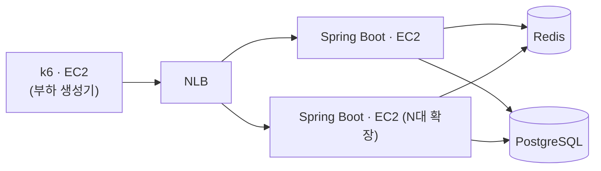

# 대규모 예약 시스템 대기열 설계 및 성능 검증

명절 승차권 예매처럼 특정 시각에 수백만 요청이 몰리는 상황을 가정하여 Redis 기반 대기열을 설계하고, 150만 요청 환경에서 처리 한계와 병목 지점을 검증한 프로젝트입니다.

## 요약

- Redis ZSet + Lua Script 기반 대기열 구현
- 150만 건 진입 테스트에서 순번 유실·중복·정원 초과 0건
- 단일 Redis 구성에서 WAS 8대로 138,548 req/s, 이 시점 Redis CPU 100~110%로 포화
- Redis Cluster 3샤드 분산으로 Redis CPU 90.3% → 약 46%, 처리량 +20.5%
- 측정 중 Tomcat 설정 하나로 처리량 +35%, 지연 중앙값 44배 개선

## 검증 범위

대기열 진입부터 순번 조회, 입장 제어까지의 흐름을 설계하고 Redis 단일 노드의 처리 한계를 검증했습니다. 좌석 선택, 결제, 회원가입 등 예약 기능 구현은 제외하고 대규모 트래픽 상황에서 대기열 처리 성능과 병목 지점 분석에 집중했습니다.

## 아키텍처

## 설계

| 문제 | 선택 | 이유 |
|--------|--------|--------|
| 대기열 저장소 | Redis ZSet | 대기열 진입, 전체 순번 조회, 특정 사용자 순번 조회, 입장 처리를 하나의 자료구조에서 처리하기 위해 선택 |
| 활성 사용자 관리 | 만료 시각 기반 ZSet | 예약 처리 시간을 고려해 TPS가 아닌 활성 사용자 수 기준으로 입장 제어하기 위해 선택 |
| 원자성 보장 | Lua Script | 정원 확인, 승격, 만료 설정 사이에 다른 요청이 끼어들어 정원이 초과되는 상황을 방지하기 위해 선택 |
| 상태 조회 | Polling | WebSocket·SSE의 연결 유지 비용을 피하고, 순번에 따라 조회 주기를 다르게 제어하기 위해 선택 |
| 확장 구조 | Redis Cluster | 단일 Redis 처리 한계를 확인한 후 처리량 확장과 장애 대응을 위해 선택 |

## 성능 측정

측정은 두 차례 했습니다. 1차는 단일 Redis, 2차는 Redis Cluster 구성입니다. 코드와 구성, 측정 세션이 모두 달라서 수치는 각 측정 안에서만 비교합니다.

### 측정 환경

| 항목 | 값 |
|--------|--------|
| WAS | c8g.large (2 vCPU, 4 GiB) 최대 13대 |
| Redis | c8g.large (2 vCPU, 4 GiB) · 1차 1대, 2차 최대 6대 |
| RDS | db.t4g.micro |
| Load Balancer | NLB |
| 부하 생성기 | c8g.8xlarge |
| 부하량 | 대기열 진입 API 150만 건 |

### 1차 · 단일 Redis에서 WAS 확장 (2026-07)

| 구성 | 처리량 | p99 | WAS CPU (대당) | Redis CPU |
|--------|--------:|--------:|--------:|--------:|
| 1대 | 17,313 req/s | 107.5ms | 96.4% | 14.7% |
| 2대 | 36,902 req/s | 58.2ms | 93.3% | 30.3% |
| 8대 | 138,548 req/s | 14.5ms | 73% | 100~110% |

- 1~2대는 WAS CPU 90% 이상으로 WAS가 병목
- 8대에서 WAS CPU 73%로 내려가고 Redis CPU 100% 초과, 병목이 Redis로 이동
- 1대 → 2대의 2.13배는 응답시간이 절반 이하로 줄어든 효과. 이 부하 모델에서는 처리량이 `동시 요청 수 ÷ 응답시간`으로 정해짐

### 2차 · Redis Cluster 3샤드 (2026-08)

WAS 8대를 고정하고 샤드 수만 1과 3으로 바꿔 측정했습니다.

| 구성 | 처리량 | Redis CPU | WAS CPU |
|--------|--------:|--------:|--------:|
| 1샤드 | 113,800 req/s | 90.3% | 97~100% |
| 3샤드 | 137,150 req/s | 약 46% | 98~99% |

- Redis CPU는 절반으로 줄었지만 처리량 증가는 20.5%
- 1샤드에서 이미 Redis와 WAS가 함께 포화 상태였고, 샤딩은 그중 Redis 쪽만 해소
- 샤드별 분배 편차 0.3% 이내
- 레플리카를 빼고 WAS를 13대까지 늘린 추가 측정에서 195,140 req/s, Redis CPU 54%
- 3샤드의 포화 지점은 계정 vCPU 한도(64)에 막혀 미측정

## 측정 중 발견한 문제

- Tomcat이 재사용하는 요청 처리 객체 수가 기본 200개라, 대당 동시 연결이 수천 개일 때 객체를 매번 새로 할당하고 버림. 8192로 올려 처리량 67,902 → 91,745 req/s(+35%), 지연 중앙값 627 → 14.3ms
- Redis 단독 한계를 재려던 벤치마크가 매 요청 같은 사용자를 넣고 있었음. ZSet은 같은 멤버를 덮어쓰므로 1,000건을 보내도 1명만 저장. 앱이 이 한계의 99%를 낸다던 기존 비교는 철회하고 고유 사용자로 재측정 예정

## 정합성 검증

2차 측정의 모든 런에서 다음을 확인했습니다.

- 발급된 순번 합 1,500,000 = 진입 성공 응답 수 → 순번 유실·중복 0건
- 대기 1,499,000 + 활성 1,000 = 1,500,000
- 활성 1,000 = 정원 → 정원 초과 0건

샤드가 셋으로 갈려도 한 사용자는 언제나 같은 샤드로 가므로, 샤드 안의 원자성만으로 전체 등식이 유지됩니다.

## Redis Cluster 구조

- Master 3 + Replica 3 구성
- Hash Tag로 한 샤드의 키를 같은 노드에 모아 Lua Script 원자성 유지
- 로컬 6프로세스 클러스터에서 자동 Failover 동작 확인. 호스트를 나눈 장애 훈련은 아직 하지 않음

트레이드오프는 전역 순번을 정확하게 계산할 수 없다는 점입니다. 모든 샤드에 물으면 폴링 한 번이 전 샤드에 부하를 주므로, 자기 샤드 순번에 샤드 수를 곱한 근사 순번을 보여 줍니다. 승격도 샤드마다 따로 하므로 전역으로 엄격한 선착순은 아닙니다.

## 남은 과제

- 폴링을 섞은 부하 측정. 지금 수치는 모두 진입 API 기준
- 도착률을 고정한 부하 모델로 3샤드의 실제 포화 지점 측정
- 고유 사용자로 Redis 단독 한계 재측정
- 호스트 단위 Failover 훈련
- 대기열 총량 상한과 매크로·중복 진입 대응

## 문서

| 문서 | 내용 |
|--------|--------|
| [docs/redis-single-thread.md](docs/redis-single-thread.md) | Redis 단일 스레드 구조와 처리 한계 |
| [docs/redis-topology.md](docs/redis-topology.md) | Standalone, Replication, Sentinel, Cluster 비교 |
| [docs/redis-cluster-bootstrap.md](docs/redis-cluster-bootstrap.md) | Redis Cluster 구축 및 Failover 실습 |
| [docs/aws-load-test.md](docs/aws-load-test.md) | AWS 2라운드 부하 측정 기록 |
| [docs/redis-benchmark-members.md](docs/redis-benchmark-members.md) | 벤치마크 요청 수와 실제 저장된 대기자 수의 차이 |
