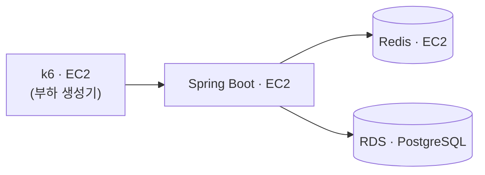
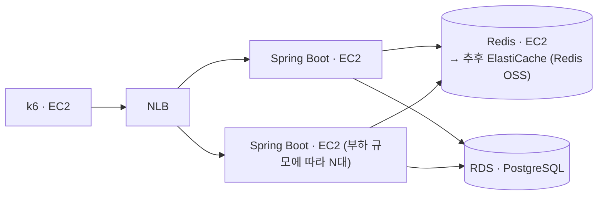

# 명절 승차권 예매

> 명절 예매급 순간 트래픽을 대기열 기반 입장 제어로 감당하는 대규모 시스템 — 병목을 직접 측정하며 설계.
> Spring Boot 4 · Java 21 · Redis 8 · PostgreSQL 18 · k6

## 프로젝트 배경 및 목적


명절 승차권 예매 환경을 가정한 대규모 예약 시스템입니다.

동시 접속자가 급증하는 상황에서 대기열, 예약 처리, 데이터베이스, 캐시 구조가 시스템 성능에 어떤 영향을 주는지 확인하기 위해서 개발을 했습니다.

단순 기능 구현보다 병목 구간을 찾고, 아키텍처 변경 전후의 처리량(TPS), 응답 시간, 자원 사용량을 측정하고 비교하는 것을 목표로 합니다.

## 문제 정의
명절 승차권 예매 서비스는 특정 시각에 대규모 사용자가 동시에 접속하는 특성을 가진 서비스입니다.

평일 승차권 예매 시스템과 달리 사용자가 좌석을 선택하거나 결제를 진행하지 않고 열차 단위로 예약을 수행합니다. 이는 제한된 시간 내에 최대한 많은 예약 요청을 처리해야 하는 명절 예매의 특성상 좌석 선택 및 결제 과정에서 발생하는 추가적인 동시성 문제와 처리 지연을 최소화하기 위한 설계라고 판단했습니다.

그럼에도 불구하고 수많은 사용자가 동시에 예약을 시도하기 때문에 다음과 같은 문제가 발생합니다.

- 순간적인 트래픽 증가로 인한 서버 및 DB 과부하
- 동일 열차에 대한 예약 요청 처리
- 잔여 좌석 수량 관리 및 데이터 정합성 보장
- 장애 발생 시 예약 데이터의 일관성 유지

실제 명절 승차권 예매 환경을 기반으로 이러한 문제를 재현하고 대기열, 캐시, 동시성 제어 전략이 시스템 성능과 안정성에 미치는 영향을 검증하는 것을 목표로 합니다.

## 설계

### Redis 기반 대기열
대기열은 단순히 요청을 순서대로 처리하는게 아니라 다음 기능을 제공해야 합니다.

- 빠른 대기열 진입
- 전체 대기 순번 조회
- 특정 사용자의 순번 조회
- 실시간 입장 처리

Kafka는 대규모 이벤트 처리에는 적합하지만 사용자의 현재 대기 순번을 실시간으로 조회하는 기능은 제공하지 않습니다. 
반면 Redis의 Sorted Set은 순번 조회, 대기열 크기 조회를 모두 O(logn) 수준으로 처리할 수 있습니다.

대기열은 단순히 조회만 수행하는 것이 아니라 정원확인 → 승격 → 만료시간 설정을 원자적 작업으로 처리를 해야합니다.
중간에 다른 요청이 끼어들면 활성 사용자 수가 실제 정원과 달라질 수 있기 때문입니다.
Redis는 단일 스레드와 Lua Script를 통해 이러한 작업을 원자적으로 처리할 수 있습니다.

그 단일 스레드가 곧 한 대의 천장이라 대기열은 Redis 여러 대로 나눠 담습니다.
그 대가로 순번이 정확한 값에서 근사값이 되는데, 왜 그 교환이 필요했는지는
[Redis는 순번의 정확도를 내주는 대가로만 옆으로 늘어납니다](#redis는-순번의-정확도를-내주는-대가로만-옆으로-늘어납니다)에 있습니다.

### 대기열 상태 조회
대기 순번은 클라이언트가 폴링하여 조회하도록 구현을 했습니다.

WebSocket, SSE는 사용자마다 연결을 유지해야 하므로, 대기 인원이 많아질수록 서버의 메모리와 소켓 자원을 지속적으로 점유합니다. 
반면에 폴링은 요청이 끝나면 연결도 종료되어 서버가 연결을 유지할 필요가 없으며, 조회 한 번이 Redis 명령 두어 개로 끝나 부담이 크지 않습니다.
대기 순번은 실시간성이 크게 중요하지 않아 수 초 이내의 조회 지연을 허용할 수 있으므로, 서버 자원 효율과 안정성을 우선해 폴링 방식을 선택했습니다.

다만 폴링은 요청 **총량**이 대기 인원에 정비례합니다.
모두가 같은 주기로 물으면 만 명이 약 2,000 rps, 가정하는 200만 명 규모에서는 폴링만으로 40만 rps가 됩니다.
조회 주기에 랜덤 지연(Jitter)을 더해 요청이 한 시점에 몰리는 것은 막았지만,
지터는 요청을 시간축에 흩을 뿐 총량을 줄이지는 못합니다.

**그래서 폴링 주기를 순번에 따라 다르게 줍니다.**
100만 번째 사람에게 5초는 아무 의미가 없습니다 — 승격은 초당 최대 500명이라
다음 폴링까지 그의 순번은 500 남짓 줄고, 돌아오는 답은 계속 "아직 아닙니다"로 같습니다.
**앞쪽은 촘촘하게, 뒤쪽은 성기게** 주면 그 낭비가 사라집니다.

기준은 순번 자체가 아니라 **남은 시간**입니다.

```
주기 = clamp(min-poll-interval, 순번 ÷ 승격 속도 ÷ poll-updates, max-poll-interval)
     = clamp(5초, 순번 × 0.5ms, 30초)
```

승격 속도는 `max-batch ÷ promote-interval`(초당 500명)을 씁니다.
승격이 한 주기에 `max-batch`를 넘지 못하므로 큐는 이보다 빨리 줄어들 수 없고,
그래서 이 식으로 잰 남은 시간은 실제보다 짧습니다 — 주기를 그 하한에 맞추면 자기 차례를 자면서 넘기지 않습니다.
`poll-updates`는 입장 전에 순번이 최소 몇 번 갱신되는지로, 화면이 멈춘 것처럼 보이지 않게 하는 값입니다.
하한이 없으면 맨 앞이 서로를 두들기고, 상한이 없으면 뒤쪽이 사실상 폴링을 멈춥니다.

**주기는 서버가 정해 응답에 실어 보냅니다.** 승격 속도와 정원은 서버만 알고 있어서,
클라이언트가 자기 순번으로 직접 계산하게 두면 튜닝값을 바꿀 때마다 JS와 k6 스크립트를 같이 고쳐야 합니다.

딸려 오는 값이 둘입니다.

- **이탈 판정 기준이 고정값으로 남을 수 없습니다.** 이탈을 알 신호가 폴링뿐이라
  뒤쪽에 30초 주기를 주면 60초 고정값은 시킨 대로 기다린 사용자를 줄에서 빼 버립니다.
  그래서 조회할 때 **"알려 준 주기 + `poll-grace`"를 기한으로 미리 구워 두고**,
  스위퍼는 그 기한이 지났는지만 봅니다.
- **주기 상한은 `admission-grace`(150초)보다 충분히 작아야 합니다.** 승격을 알아채는 것도
  폴링이라, 주기가 길면 그만큼이 입장 확정 시간에서 깎입니다. 순번이 줄면서 주기도 함께
  짧아지므로 실제로 걸릴 일은 적지만, 상한을 정할 때 근거로 삼는 값입니다.

### 활성 사용자 수 기반 입장 제어
입장 제어는 일정 주기마다 N명을 통과시키는 방식이 아니라 활성 사용자 수를 기준으로 구현했습니다.

활성 사용자는 Redis Sorted Set으로 관리하고, score에는 만료 시각을 저장했습니다.
만료된 사용자는 `ZREMRANGEBYSCORE`로 정리하고, 현재 활성 인원은 `ZCARD`로 조회합니다.

초당 N명을 통과시키는 방식은 유입 속도만 제한할 뿐, 실제로 시스템이 처리 중인 사용자 수는 제어하기 어렵습니다.
반면 활성 사용자 수를 기준으로 제한하면 로그인, 예약, DB가 동시에 처리해야 하는 인원에 상한을 둘 수 있습니다.

사용자 상태에 따라 만료 시간을 갱신하며, 만료 시각을 하나의 score로 관리해 활성 사용자 정리와 정원 계산을 단순하게 유지했습니다.

### 배치 승격 상한 설정
대기열 승격은 Redis Lua Script로 처리하며, 한 번에 승격할 수 있는 인원 수에 상한을 두었습니다.

Redis는 단일 스레드로 동작하기 때문에 스크립트가 실행되는 동안 다른 요청이 끼어들 수 없습니다.
이를 통해 정원 확인 → 승격 → 만료 설정을 원자적으로 처리할 수 있지만, 반대로 스크립트 실행 시간이 길어지면 다른 요청도 함께 대기하게 됩니다.

따라서 정원이 한꺼번에 비더라도 모든 사용자를 즉시 승격하지 않고, 일정 인원 단위로 나누어 처리하도록 설계했습니다.
이를 통해 원자성은 유지하면서도 특정 시점의 Redis 부하가 급격히 증가하는 것을 방지했습니다.

### Redis 장애 대응
대기열은 Redis에 저장되지만, Redis를 영구 데이터 저장소로 사용하지는 않았습니다.

예약 데이터는 PostgreSQL에 저장되며, Redis에는 현재 대기 상태만 관리합니다.
따라서 Redis 장애 시 대기열은 유실될 수 있지만, 예약 데이터 자체에는 영향을 주지 않습니다.
이번 프로젝트에서는 일부만 복구된 대기열보다 명확하게 초기화된 대기열이 운영 측면에서 더 안전하다고 판단하여 Redis 영속성을 비활성화했습니다.

## 동작 흐름

진입부터 로그아웃까지 한 사람이 지나가는 경로입니다.
Redis를 건드리는 모든 지점이 Lua 스크립트 하나에 대응하고, 진실 원천은 두 ZSet뿐입니다.

| 단계 | 스크립트 · 명령 | 원자성이 필요한 이유 |
|---|---|---|
| 진입 | `enqueue.lua` | 순번 발급과 등록이 갈라지면 순번이 유실되거나 겹친다 |
| 순번 조회 | `status.lua` | `ZCARD`·`ZRANK`가 다른 순간의 값이면 앞뒤 합이 어긋난다 ([배치 승격 상한 설정](#배치-승격-상한-설정)) |
| 이탈 | `leave.lua` | `waiting`에서만 빠지고 `poll`에 남으면 스위퍼가 매 주기 헛돈다 |
| 이탈 회수 | `sweep.lua` | 찾는 것과 지우는 것이 갈라지면 그 사이에 승격된 사람을 지운다 |
| 승격 | `promote.lua` | 세는 것과 꺼내는 것이 갈라지면 정원을 넘긴다 ([활성 사용자 수 기반 입장 제어](#활성-사용자-수-기반-입장-제어)) |
| 입장 확정 | `restamp.lua` | 만료된 슬롯을 되살리지 않으려면 검사와 갱신이 한 연산이어야 한다 |
| 로그인 | `restamp.lua` | 같은 스크립트, `ttl`만 다르다 ([활성 사용자 수 기반 입장 제어](#활성-사용자-수-기반-입장-제어)) |
| 화면 진입 게이트 | `status.lua` 재사용 | 쿠키의 존재가 아니라 `active`의 score를 본다 |
| 로그아웃 | `ZREM` 단일 명령 | 원자성이 필요 없다 — 묶을 것이 없다 |

게이트(`AdmissionGuard`·`LoginGuard`)는 `/**`가 아니라 `/login` · `/reservation` ·
`/reservations` · `/reservations/*/cancel` 네 경로만 탑니다.
`/logout`은 일부러 빼 뒀습니다 — 입장권이 만료된 사람도 세션은 정리할 수 있어야 하고,
자격이 없다고 돌려보내면 세션만 남습니다.

## 인프라 아키텍처

측정이 목적인 시스템이라, 컴포넌트를 분리해 병목을 각각 따로 관찰할 수 있게 배치합니다.
인스턴스·보안 그룹과 부트스트랩·측정 스크립트는 [infra/aws](infra/aws)에 있습니다.

**한 번에 세우지 않고 두 단계로 나눕니다.** 지금 급한 것은 다중화가 아니라 부하 생성기 분리입니다 —
앱 지연 35ms 중 Redis는 1~3ms이고, 나머지 90% 이상이 Tomcat·가상 스레드·루프백 TCP,
그리고 **같은 머신에서 도는 k6와의 CPU 경합**이었습니다.

### 1단계 — 부하 생성기를 떼어냅니다



NLB가 없습니다. WAS 1대의 천장을 모르는 상태로는 N대의 이득을 말할 수 없고,
**NLB가 얹는 비용을 아는 것 자체가 측정 결과**라 기준선에 섞으면 분리해 낼 수 없기 때문입니다.
k6는 WAS의 프라이빗 IP에 직접 붙습니다.

- **부하 생성기(k6)는 WAS와 분리합니다.** 같은 머신에서 CPU를 나눠 쓰면 측정 대상이 아니라
  생성기를 측정하게 됩니다.
- **Redis는 EC2에서 실행합니다.** 대기열의 진실 원천이라 CPU·메모리·버전을 직접 통제해 재현성을
  지킵니다. 추후 **ElastiCache(Redis OSS)**로 옮겨 관리형과 자체 호스팅의 처리량·지연을 비교할 수
  있습니다.
- **DB는 RDS의 PostgreSQL을 사용합니다.** 계정·예약 테이블뿐이라 진입 hot path엔 걸리지 않아
  관리형으로 운영 부담을 덜되, 다음 좌석 페이즈의 배타 제약(EXCLUDE + GiST)·MVCC를 위해 엔진은
  PostgreSQL을 유지합니다.
- **전부 같은 AZ·같은 서브넷에 둡니다.** 로컬에서 Docker 왕복 0.31ms가 Redis가 실제로 일하는
  8.37μs의 약 37배였는데, 크로스 AZ가 그 교훈의 AWS 판본입니다.

**WAS는 작게, k6는 크게 잡습니다.** 부하 생성기가 먼저 포화되면 측정 대상이 아니라 생성기의
한계를 재게 됩니다. WAS를 작은 인스턴스에서 시작해 키우며 쓸면 그 자체가 **vCPU당 처리량** 측정이
되고, 2단계에서 몇 대가 필요한지의 근거가 됩니다.

### 2단계 — WAS를 늘립니다



**앞단은 L4인 NLB입니다.** 대기열 진입·조회 경로가 사실상 얇은 Redis 프록시라 요청당 지연에
민감한데, NLB는 HTTP 파싱 없이 통과시켜 측정에 얹는 변수가 가장 적습니다. 명절 rush 같은 순간
급증도 사전 워밍업 없이 받아냅니다. 경로 라우팅·WAF 같은 L7 기능이 필요해지면 그때 ALB를
재검토합니다.

두 가지가 선행되어야 합니다. 톰캣 인메모리 세션을 Redis로 외부화하고
(`spring-session-data-redis`), 승격 스케줄러를 단일화합니다 — 인스턴스마다 돌면 승격 배치가
N배가 되기 때문입니다. 각각에 딸린 갈래
(세션을 대기열과 같은 Redis에 둘 것인지, 리더 선출 대신 플래그로 1대만 켤 것인지)는
[infra/aws](infra/aws)에 정리했습니다.

### Redis는 순번의 정확도를 내주는 대가로만 옆으로 늘어납니다

WAS는 NLB 뒤로 N대까지 늘리면 됩니다. Redis도 늘어나긴 하는데, **관리형 도구로는 안 되고
순번을 근사값으로 바꿔야만 됩니다.** 세 갈래를 따져 보면 그렇습니다.

- **Cluster로 가려면 키를 먼저 묶어야 합니다.** `waiting:` / `active:` 접두사가 달라 두 키가
  다른 슬롯에 떨어지고, 둘을 함께 넘기는 `status`·`promote`가 CROSSSLOT으로 깨집니다.
  해시 태그로 묶는 것이 선행 조건입니다.
- **묶으면 Cluster를 쓰는 의미가 사라집니다.** 묶는다는 건 한 이벤트의 키를 같은 슬롯(=같은
  노드)에 모으는 것이라, 그 이벤트의 트래픽은 전부 한 노드로 갑니다. Cluster의 분할 축은
  이벤트(날짜·열차) 단위뿐이고, 한 이벤트 안에서는 아무것도 나뉘지 않습니다.
- **조회를 리플리카로 보내는 길은 닫혀 있습니다.** 조회 경로가 하트비트로 `poll`에
  `ZADD`를 하기 때문에 애초에 읽기 전용이 아니고, 리플리카는 쓰기를 받지 않습니다.

그래서 **Cluster를 쓰지 않고 클라이언트가 직접 샤드를 고릅니다.** 토큰의
`Math.floorMod(hashCode(), 샤드 수)`가 그 사람의 샤드이고, 한 샤드의 네 키는 반드시 같은
인스턴스에 둡니다 — `promote`가 `waiting`에서 꺼내 `active`에 넣는 것을 한 스크립트로 묶어
정원을 지키는데, 두 키가 갈라지면 그 원자성이 사라지기 때문입니다.

측정은 [k6/shard-probe.sh](k6/shard-probe.sh)에 있습니다. 100만 건 진입 기준입니다.

| 샤드 | 벽시계 | 처리량 | 배수 | evalsha/호출 | 메모리 |
| --- | --- | --- | --- | --- | --- |
| 1 | 7.890s | 126,743/s | 1.00x | 3.87 µs | 199 B/명 |
| **3** | **2.690s** | **371,747/s** | **2.93x** | 3.85 µs | 220 B/명 |

**호출당 시간이 그대로인 것이 이 표의 핵심입니다.** 깊이가 100만에서 33만으로 줄어 `ZADD`의
`log₂`가 19.9에서 18.3이 됐는데도 3.87 → 3.85 µs로 변하지 않았고, 그 몫은 Redis 프로세스
셋이 코어와 캐시를 나눠 쓰는 비용이 도로 가져갔습니다. **2.93배는 자료구조를 얕게 만들어서가
아니라 이벤트 루프가 셋이 되어서 나온 값입니다** — 같은 인스턴스 안에서 키만 쪼개면 이 배수는
나오지 않습니다.

#### 대가는 전역 순번입니다

전역 순번을 정확히 구하려면 내 샤드의 `ZRANK`에 다른 샤드들의 `ZCOUNT`를 더해야 합니다.
그러면 **조회 한 번이 모든 샤드를 때립니다.**

```
조회 N건 → 각 샤드가 받는 호출 = N   (내 샤드 1 + 남의 샤드 K-1, 모든 샤드에 1건씩)
샤딩하지 않았을 때                = N
```

산술이 그대로입니다. 스캐터-개더는 읽기 처리량을 전혀 늘리지 못하고, 지배 부하가 폴링이므로
그 길로 가면 샤딩할 이유 자체가 없어집니다. 게다가 그 여러 호출은 인스턴스가 달라 원자적이지
않아, `status.lua`가 보장하던 **한 스냅샷**도 함께 잃습니다.

그래서 **곱셈으로 근사합니다.**

```
앞 인원 = ZRANK(내 샤드) × 샤드 수
전체    = ZCARD(내 샤드) × 샤드 수
뒤 인원 = 전체 − 앞 인원 − 1
```

셋을 같은 배수로 곱하므로 `앞 + 뒤 + 1 = 전체`도, "순번은 줄기만 한다"도 그대로 성립합니다.
오차는 내 앞의 사람들이 샤드에 흩어지는 정도라 `sqrt(p(k-1))`이고, 실제 UUID 해시 분배에서
이 모델이 그대로 맞았습니다.

| 전역 순번 | 최대 오차 | 1σ | |
| --- | --- | --- | --- |
| 10만 | 455 | 445 | 1.0σ |
| 50만 | 1,883 | 999 | 1.9σ |
| 100만 | 3,282 | 1,414 | 2.3σ |

100만 번째 사람이 보는 숫자가 최대 0.33% 어긋납니다. 화면에 "999,000명"과 "1,002,282명" 중
무엇이 떠도 사람은 구별하지 못합니다. **같은 근사가 승격에도 적용됩니다** — 샤드마다 정원의
몫을 갖고 자기 줄의 앞에서 꺼내므로 전역 선착순이 엄격하지 않고, 그 어긋남의 폭도 같은 0.33%
규모입니다.

이 근사가 서 있는 전제는 **샤드 깊이가 고르다**는 것 하나뿐입니다. 그래서 큐 지표를 `shard`
태그로 갈라 두었습니다 — 샤드별 `queue.waiting`이 벌어지는 것이 곧 순번이 그만큼 틀리고
있다는 신호이고, 근사가 무너지는 것을 알아챌 수 있는 유일한 지점입니다.

#### 읽기를 리플리카로 흩는 길은 여전히 닫혀 있습니다

이건 샤딩과 별개로 남아 있는 트레이드오프입니다. **유령을 회수하는 값과 읽기를 흩는 값 중
하나를 골라야 했고, 회수를 골랐습니다.**

되돌린다면 순서는 이렇습니다. `poll` 갱신을 조회에서 떼어내 별도 하트비트로 옮기면
(요청 수는 두 배가 됩니다) 조회가 다시 읽기 전용이 되지만, 그래도 한 관문이 더 남습니다 —
`status.lua`라서 `EVALSHA`는 읽기 전용으로 선언되지 않아 리플리카로 라우팅되지 않습니다
(Redis 7이 `EVAL_RO`를 추가한 이유가 이것입니다). 그런데 spring-data-redis 4.1.0의
`RedisScriptingCommands`에는 `eval`·`evalSha`만 있고 RO 변종이 없어,
`DefaultScriptExecutor`는 항상 `EVALSHA`를 부릅니다. Lua를 벗고 개별 명령으로 돌아가면
`status.lua`가 보장하던 한 스냅샷을 잃습니다 — 복제 지연만큼 순번이 과거값이 되는 것은
이미 허용한 대가([대기열 상태 조회](#대기열-상태-조회))지만,
`앞 + 뒤 + 1 = 전체`가 어긋나는 건 다른 종류의 대가입니다.

#### 언제 샤드를 늘리는가

폴링 부하는 대기 인원에서 바로 나옵니다. 주기가 `clamp(5초, 순번 × 0.5ms, 30초)`이므로,
앞 1만 명이 2,000/s, 비례 구간이 `2000 × ln(6)` = 3,583/s, 나머지가 30초 주기라
`(대기 인원 − 60,000) ÷ 30`입니다.

| 대기 인원 | 폴링 부하 | 샤드 한 대(105k/s) 대비 |
| --- | --- | --- |
| 100만 | 36,900/s | 35% |
| 200만 | 70,200/s | 67% |
| **300만** | **103,600/s** | **포화** |

**샤드 하나가 감당하는 것이 대략 300만 명입니다.** 진입 폭주는 더 이른 쪽 제약으로,
100만 건을 흡수하는 데 샤드당 약 9.5초가 걸립니다. 지금 3개를 쓰는 근거가 이 둘입니다.

여기 나오는 네 구성(Standalone · Replication · Sentinel · Cluster)이 각각 어떻게 동작하고
무엇을 주고 무엇을 못 주는지는 [docs/redis-topology.md](docs/redis-topology.md)에 정리했습니다.

## 측정 결과

1단계 구성(k6 · WAS · Redis · RDS를 각각 전용 인스턴스로, 전부 같은 AZ)에서 잰 값입니다.
WAS는 `c8g.large`(2 vCPU) 한 대입니다.

**진입 경로에는 서로 다른 이유로 걸리는 천장이 둘 있습니다.** 부하 모델이 그중 어느 것을
재는지 결정하므로, 하나로 합쳐 말하면 둘 다 틀리게 됩니다.

| | 도착 방식 | 천장 | 실측 |
| --- | --- | --- | --- |
| **closed** | 응답을 받아야 다음을 보낸다 | **CPU** | **17,700/초** |
| **open** | 서버 사정과 무관하게 도착한다 | **커널 accept 큐** | **약 10,000/초** |

closed는 "얼마나 빨리 처리하는가"이고 open은 "얼마나 몰려도 받아내는가"입니다.
명절 오픈 순간은 후자의 모양이고, 거기서 먼저 무너지는 것은 CPU가 아니라 커널의 accept 큐입니다 —
도착률을 12배로 올려도 받아내는 양이 늘지 않았고, 그동안 `TcpExtListenOverflows`가 70만까지
올라가는 사이 `TcpExtTCPReqQFullDrop`은 0이었습니다. 실효 백로그는
`min(accept-count, somaxconn)` = 1,000입니다.

**100만 명이 줄에 서도 처리량은 떨어지지 않았습니다.** 30만에서 17,268~17,795,
100만에서 17,996으로 오히려 살짝 높습니다. 메모리는 271MB이고 1인당 284바이트로,
규모가 커질수록 1인당 값이 줄어듭니다(30만에서는 312바이트).

**같은 조건 3런의 편차가 3.0%입니다.** 로컬에서는 같은 코드가 그날 34k, 다른 날 19k로
갈렸습니다. 부하 생성기를 떼어내고 워밍업을 넣은 것이 그 폭을 3%로 줄였고,
이제 변경 전후를 비교할 수 있습니다.

로컬(단일 Mac)에서 잰 값은 k6와 앱이 CPU를 나눠 쓰는 조건이라 위 수치와 **같은 축에 둘 수
없습니다.**

### 무엇을 읽는가

k6는 클라이언트 쪽만 봅니다 — 응답 시간과 상태 코드입니다. 정작 확인해야 하는
"정원이 지켜지는가", "초당 몇 명이 통과하는가"는 서버 안에 있어서, 큐 상태를
`/actuator/metrics`로 내보냅니다.

| 지표 | 뜻 |
| --- | --- |
| `queue.waiting` | 마지막 승격 주기가 본 대기 인원 |
| `queue.active` | 마지막 승격 주기가 본 활성 인원 |
| `queue.promoted` | 누적 승격 인원 |
| `queue.swept` | 누적 유령 회수 인원. 폴링이 끊긴 대기자를 얼마나 걷어내고 있는지 |

**넷 다 `shard` 태그로 나뉩니다.** 태그 없이 물으면 합이 나오므로 아래 해석은 그대로 쓰이고,
태그로 좁히면 샤드별로 보입니다.

```
/actuator/metrics/queue.active                 → 합 (정원과 비교할 값)
/actuator/metrics/queue.active?tag=shard:2     → 샤드 2만
```

**샤드별 `queue.waiting`이 벌어지는 것이 순번 근사가 무너지는 신호입니다.** 전역 순번을
`샤드 안 순번 × 샤드 수`로 계산하고 있어서, 그 전제인 균등 분배가 깨지면 순번이 그만큼
틀립니다. 화면에는 아무 이상이 없어 보이므로 이 지표 말고는 알아챌 길이 없습니다.

값은 스케줄러 주기(승격 1초 · 회수 5초)에만 갱신됩니다. `promote.lua`가 이미 돌려주던
값을 그대로 쓰므로 Redis 호출도, 요청당 비용도 늘지 않습니다 —
요청마다 로그를 켜면 큐가 아니라 로거를 측정하게 되는 것과 같은 이유입니다.

**`queue.active`가 `capacity`를 넘지 않는 것**이 입장 제어가 실제로 걸린다는 확인입니다.
진입이 몰리는 동안 이 값이 `capacity`에서 멈추고 `queue.waiting`만 올라가면 제어가 동작한 것입니다.

**`queue.promoted`는 대기열 총량 상한을 정하는 값입니다.** 상한을 유도하려면 슬롯 보유 시간이
필요한데, `active` ZSet의 score는 만료 시각이라 시작 시각이 없어 직접 잴 수 없습니다.
대신 회전율을 셉니다.

```
초당 처리 인원 = queue.promoted ÷ 경과 시간
총량 상한      = 초당 처리 인원 × 영업시간
```

**`queue.swept`는 이탈 판정이 맞게 잡혔는지 보여줍니다.** 회수량이 실제 이탈보다 크게 나오면
판정 기준이 짧아 순단으로 백오프 중이던 멀쩡한 사용자를 줄에서 빼내고 있다는 뜻입니다.
다만 판정 기준이 이제 사람마다 다르므로(주기 + `poll-grace`) 이 수치 하나가 한 설정값을
가리키지는 않습니다. `poll-grace`와 `max-poll-interval`을 함께 놓고 봐야 합니다.

지표에는 인증이 없습니다. 로컬 학습 환경을 전제로 열어 둔 것이므로, 외부에 노출되는 환경에서는
경로를 막거나 `management.server.port`로 포트를 분리해야 합니다.

## 앞으로 할 일

### 부하 목표를 "초당 처리량"이 아니라 "총 요청 수 + 제한 시간"으로 다시 정의합니다

지금까지의 측정은 축이 rps 하나입니다(앱 34,129 rps · knee는 VUS 1,000 근처).
그런데 명절 예매가 요구하는 건 초당 100만 건을 계속 받아내는 것이 아닙니다.
개시 시각에 몰리는 사람은 유한하고 — 가정하는 규모는 **총 200만 요청** — 이들이
**제한 시간 안에** 줄에 들어가 순번을 받으면 됩니다.
초당 처리량을 목표로 잡으면 순간 최고치를 쫓게 되지만, 실제로 지켜야 하는 건
"몰린 전부가 유한한 시간 안에 처리되는가"입니다.

축을 바꾸면 성공 기준도 바뀝니다. "초당 몇 건인가"가 아니라
**"200만 건이 다 들어가는 데 얼마나 걸렸고, 그 사이 몇 건이 제한 시간을 넘겨 실패했는가"**입니다.
정원이 이미 유입 속도를 끊고 있으므로([활성 사용자 수 기반 입장 제어](#활성-사용자-수-기반-입장-제어))
이 숫자에 비례해 커지는 건 뒷단이 아니라 진입 API와 폴링 경로뿐입니다.
폴링 쪽은 [주기를 순번에 따라 다르게](#대기열-상태-조회) 줘서 이미 한 번 깎아 뒀고,
남은 것은 진입 경로입니다 — 그쪽은 1인당 1회라 주기로 줄일 여지가 없습니다.

그래서 타임아웃이 성공 기준의 일부가 됩니다. 무한정 기다리게 두면 "전부 처리했다"는 말은
언제나 참이 되고, 대신 사용자는 응답 없는 화면을 봅니다. 상한을 정해 두고 그 안에 못 들어간
요청을 실패로 세야 숫자가 의미를 가집니다. 지금 걸려 있는 것은 클라이언트의
`AbortSignal`(진입 10초 · 조회 5초)과 `loadtest`의 Redis 타임아웃(1초)뿐이고,
**요청 단위 상한을 서버가 스스로 강제하는 지점은 없습니다**([Redis 장애 대응](#redis-장애-대응)).

- 200만 요청을 개시 시각에 밀어 넣는 k6 시나리오를 만든다 — VU 수가 아니라 총량과 유입 창이 입력값이다.
- 진입·조회 경로에 서버 측 요청 타임아웃을 두고, 초과를 매달림이 아니라 명시적 실패 응답으로 끊는다.
- 지표를 바꾼다 — 평균 rps 대신 **총 소요 시간 · 타임아웃 비율 · p99**.

아직 정하지 않은 값이 둘 있습니다. 제한 시간을 몇 분으로 둘지, 그리고 그 시간이
"200만 명 전체가 줄에 들어가는 창"인지 "요청 한 건이 응답을 받아야 하는 상한"인지입니다.
둘은 다른 값이고 실패로 세는 대상도 다릅니다.
