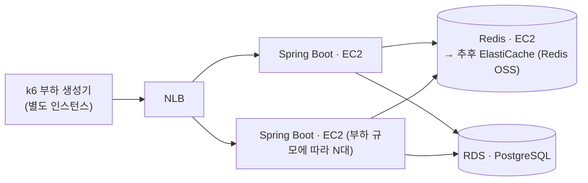

# 명절 승차권 예매

> 명절 예매급 순간 트래픽을 대기열 기반 입장 제어로 감당하는 대규모 시스템 — 병목을 직접 측정하며 설계.
> Spring Boot 4 · Java 21 · Redis 8 · PostgreSQL 18 · k6

## 프로젝트 배경 및 목적

명절 승차권 예매 환경을 가정한 대규모 예약 시스템입니다.

동시 접속자가 급증하는 상황에서 대기열, 예약 처리, 데이터베이스, 캐시 구조가 시스템 성능에 어떤 영향을 주는지 확인하기 위해서 개발을 했습니다.

단순 기능 구현보다 병목 구간을 찾고, 아키텍처 변경 전후의 처리량(TPS), 응답 시간, 자원 사용량을 측정하고 비교하는 것을 목표로 합니다.

## 문제 정의
명절 승차권 예매 서비스는 특정 시각에 대규모 사용자가 동시에 접속하는 특성을 가진 서비스입니다.

평일 승차권 예매 시스템과 달리 사용자가 좌석을 선택하거나 결제를 진행하지 않고 열차 단위로 예약을 수행합니다. 이는 제한된 시간 내에 최대한 많은 예약 요청을 처리해야 하는 명절 예매의 특성상 좌석 선택 및 결제 과정에서 발생하는 추가적인 동시성 문제와 처리 지연을 최소화하기 위한 설계라고 판단했습니다.

그럼에도 불구하고 수많은 사용자가 동시에 예약을 시도하기 때문에 다음과 같은 문제가 발생합니다.

- 순간적인 트래픽 증가로 인한 서버 및 DB 과부하
- 동일 열차에 대한 예약 요청 처리
- 잔여 좌석 수량 관리 및 데이터 정합성 보장
- 장애 발생 시 예약 데이터의 일관성 유지

실제 명절 승차권 예매 환경을 기반으로 이러한 문제를 재현하고 대기열, 캐시, 동시성 제어 전략이 시스템 성능과 안정성에 미치는 영향을 검증하는 것을 목표로 합니다.

## 설계

### 1. 대기열은 왜 Redis인가 (vs Kafka)
대기열은 단순히 요청을 순서대로 처리하는게 아니라 다음 기능을 제공해야 합니다.

- 빠른 대기열 진입
- 전체 대기 순번 조회
- 특정 사용자의 순번 조회
- 실시간 입장 처리

Kafka는 대규모 이벤트 처리에는 적합하지만 사용자의 현재 대기 순번을 실시간으로 조회하는 기능은 제공하지 않습니다. 
반면 Redis의 Sorted Set은 순번 조회, 대기열 크기 조회를 모두 O(logn) 수준으로 처리할 수 있습니다.

대기열은 단순히 조회만 수행하는 것이 아니라 정원확인 → 승격 → 만료시간 설정을 원자적 작업으로 처리를 해야합니다.
중간에 다른 요청이 끼어들면 정원 수가 어긋날 수 있기 때문입니다.
Redis는 단일 스레드와 Lua Script를 통해 이러한 작업을 원자적으로 처리할 수 있습니다.

### 2. 대기열 상태 조회 폴링에 지터를 적용
대기 순번은 클라이언트가 주기적으로 폴링하여 조회하도록 구현을 했습니다.

WebSocket, SSE는 사용자마다 연결을 유지해야 하므로, 대기 인원이 많아질수록 서버의 메모리와 소켓 자원을 지속적으로 점유합니다. 
반면에 폴링은 요청이 끝나면 연결도 종료되어 서버가 연결을 유지할 필요가 없으며, 조회도 Redis 읽기 한번으로 처리되어 부담이 크지 않습니다.

또한 모든 클라이언트가 동일한 주기로 요청하면 특정 시점에 트래픽이 집중될 수 있어, 조회 주기에 작은 랜덤 지연(Jitter)을 추가해 요청을 분산했습니다.
대기 순번은 실시간성이 크게 중요하지 않아 수 초 이내의 조회 지연을 허용할 수 있으므로, 서버 자원 효율과 안정성을 우선해 폴링 방식을 선택했습니다.

### 3. 입장 제어는 속도가 아니라 정원 기준
입장 인원을 초당 N명 방출로 정하는 방식도 가능했습니다.
하지만 이 방식은 유입 속도만 늦출 뿐, 뒷단에 쌓이는 활성 인원은 계속 늘어납니다.
정원을 기준으로 하면 로그인, 예약, DB가 동시에 상대할 인원에 상한이 생깁니다.
대신 나간 사람과 만료된 사람을 추적하는 일이 새로 필요해집니다.

활성 사용자는 ZSet에 담고 만료 시각을 score에 넣었습니다.
사용자마다 키를 하나씩 두고 Redis TTL에 맡기면 만료는 자동이지만, 인원을 세려면 `SCAN`이 필요합니다.
정원 유지는 매 주기 인원을 세는 일이라 그 비용을 감당할 수 없습니다.
만료 시각을 score에 넣으면 정리는 `ZREMRANGEBYSCORE`, 인원은 `ZCARD`로 각각 한 번에 끝납니다.

이 score는 단계마다 다시 기록됩니다(승격 150초 → 입장 확정 10분 → 로그인 3분 → 로그아웃 삭제).
값이 하나뿐이라 만료를 판정하는 곳도 하나입니다.

### 4. 단일 스레드의 원자성과 배치 상한
정원 확인 → 승격 → 만료 설정을 원자적으로 묶을 수 있는 이유는 Redis가 단일 스레드이기 때문입니다.
스크립트가 실행되는 동안에는 다른 요청이 끼어들 수 없습니다.
같은 이유로 스크립트가 실행되는 동안 다른 모든 요청은 대기합니다.
원자성을 얻는 근거와 지연이 생기는 원인이 같습니다.

그래서 한 주기에 승격하는 인원에 `max-batch`(500) 상한을 뒀습니다.
정원이 한꺼번에 비었을 때 만 명을 한 번에 올리면 그 실행 시간이 그대로 다른 요청의 대기 시간이 됩니다.
상한이 실제로 동작하는 것은 대기 인원이 `10,000 → 9,500 → 9,000`으로
두 주기에 나뉘어 줄어드는 것으로 확인했습니다.

`promote.lua`가 `ZADD`를 루프로 처리하는 것도 같은 이유입니다.
Lua `unpack`에는 스택 한계(약 8,000)가 있어 한 번에 넘기면 배치가 커질 때 스크립트가 실패합니다.

다만 500이 적절한 값인지는 아직 확인하지 못했습니다.

### 5. Redis 장애와 메모리 한계 대응
대기열이 Redis에만 있으므로 Redis가 사라지면 대기열도 사라집니다.
영속성을 켜는 방법이 있지만, `appendfsync everysec`으로도 크래시 시 최대 1초분이 유실됩니다.
일부만 남은 대기열은 아예 없는 대기열보다 다루기 어렵습니다.

그래서 Redis가 잃는 것을 데이터가 아니라 대기 순서의 공정성으로 정의했습니다.
예약 기록은 PostgreSQL에 있고, 대기열 소실은 이미 만료와 같은 경로로 처리됩니다.
영속성은 껐습니다(`save ""`, `appendonly no`).

메모리가 가득 차는 경우는 다르게 처리합니다.
`allkeys-lru`는 대기 순번을 조용히 삭제해 대기열 자체를 망가뜨리므로 `noeviction`을 선택했습니다.
쓰기 거부는 에러로 드러나 대응할 수 있기 때문입니다.
`maxmemory`(512mb)를 컨테이너 `mem_limit`(1G)보다 낮게 잡은 것도 같은 이유로,
컨테이너 OOM Kill 대신 애플리케이션이 관측 가능한 에러를 받게 하려는 것입니다.

실제로 Redis를 중단시켜 보면 진입 API는 503을 반환하고,
승격 스케줄러는 죽지 않고 Redis 복구 후 다음 주기에 재개합니다.

## 동작 흐름

진입부터 로그아웃까지 한 사람이 지나가는 경로입니다.
Redis를 건드리는 모든 지점이 Lua 스크립트 하나에 대응하고, 진실 원천은 두 ZSet뿐입니다.

| 단계 | 스크립트 · 명령 | 원자성이 필요한 이유 |
|---|---|---|
| 진입 | `enqueue.lua` | 순번 발급과 등록이 갈라지면 순번이 유실되거나 겹친다 |
| 순번 조회 | `status.lua` | `ZCARD`·`ZRANK`가 다른 순간의 값이면 앞뒤 합이 어긋난다 ([4번](#4-단일-스레드의-원자성과-배치-상한)) |
| 이탈 | `leave.lua` | `waiting`에서만 빠지고 `seen`에 남으면 스위퍼가 매 주기 헛돈다 ([대기열 이탈 처리](docs/design.md#대기열-이탈-처리)) |
| 이탈 회수 | `sweep.lua` | 찾는 것과 지우는 것이 갈라지면 그 사이에 승격된 사람을 지운다 |
| 승격 | `promote.lua` | 세는 것과 꺼내는 것이 갈라지면 정원을 넘긴다 ([3번](#3-입장-제어는-속도가-아니라-정원-기준)) |
| 입장 확정 | `restamp.lua` | 만료된 슬롯을 되살리지 않으려면 검사와 갱신이 한 연산이어야 한다 |
| 로그인 | `restamp.lua` | 같은 스크립트, `ttl`만 다르다 ([3번](#3-입장-제어는-속도가-아니라-정원-기준)) |
| 화면 진입 게이트 | `status.lua` 재사용 | 쿠키의 존재가 아니라 `active`의 score를 본다 ([설계 상세](docs/design.md#구현하면서-정한-것)) |
| 로그아웃 | `ZREM` 단일 명령 | 원자성이 필요 없다 — 묶을 것이 없다 |

게이트(`AdmissionGuard`·`LoginGuard`)는 `/**`가 아니라 `/login` · `/reservation` ·
`/reservations` · `/reservations/*/cancel` 네 경로만 탑니다.
`/logout`은 일부러 빼 뒀습니다 — 입장권이 만료된 사람도 세션은 정리할 수 있어야 하고,
자격이 없다고 돌려보내면 세션만 남습니다.

## 인프라 아키텍처

측정이 목적인 시스템이라, 컴포넌트를 분리해 병목을 각각 따로 관찰할 수 있게 배치합니다.

- **Spring Boot(WAS)는 EC2에서 실행하고, 부하 규모에 따라 여러 대로 늘려 앞단에 NLB를 둡니다.**
  대기열 진입·조회 경로가 사실상 얇은 Redis 프록시라 요청당 지연에 민감한데, L4인 NLB는 HTTP
  파싱 없이 통과시켜 측정에 얹는 변수가 가장 적습니다. 명절 rush 같은 순간 급증도 사전 워밍업 없이
  받아냅니다. 경로 라우팅·WAF 같은 L7 기능이 필요해지면 그때 ALB를 재검토합니다.
- **부하 생성기(k6)는 WAS와 분리합니다.** 같은 머신에서 CPU를 나눠 쓰면 측정 대상이 아니라
  생성기를 측정하게 됩니다.
- **DB는 RDS의 PostgreSQL을 사용합니다.** 계정·예약 테이블뿐이라 진입 hot path엔 걸리지 않아
  관리형으로 운영 부담을 덜되, 다음 좌석 페이즈의 배타 제약(EXCLUDE + GiST)·MVCC를 위해 엔진은
  PostgreSQL을 유지합니다.
- **Redis는 EC2에서 실행합니다.** 대기열의 진실 원천이라 CPU·메모리·버전을 직접 통제해 재현성을
  지킵니다. 추후 **ElastiCache(Redis OSS)**로 옮겨 관리형과 자체 호스팅의 처리량·지연을 비교할 수
  있습니다.

다중 WAS로 확장할 때는 두 가지가 선행되어야 합니다. 톰캣 인메모리 세션을 Redis로 외부화하고
(`spring-session-data-redis`), 승격 스케줄러를 단일화합니다 — 인스턴스마다 돌면 승격 배치가
N배가 되기 때문입니다. 근거는 [설계 상세](docs/design.md)에 있습니다.

### Redis는 이 워크로드에서 옆으로 늘어나지 않습니다

WAS는 NLB 뒤로 N대까지 늘리면 되지만, Redis는 같은 방식으로 늘어나지 않습니다.
세 갈래를 다 따져 보면 결론이 같습니다.

- **Cluster로 가려면 키를 먼저 묶어야 합니다.** `waiting:` / `active:` 접두사가 달라 두 키가
  다른 슬롯에 떨어지고, 둘을 함께 넘기는 `status`·`promote`가 CROSSSLOT으로 깨집니다.
  해시 태그로 묶는 것이 선행 조건입니다.
- **묶어도 샤딩 이득이 없습니다.** 묶는다는 건 한 이벤트의 키를 같은 슬롯(=같은 노드)에
  모으는 것이라, 그 이벤트의 트래픽은 전부 한 노드로 갑니다. 대기열은 본질적으로 단일 핫 키
  워크로드이고, 실질적인 분할 축은 이벤트(날짜·열차) 단위뿐입니다.
  다만 이건 아직 측정하지 않은 판단입니다.
- **조회를 리플리카로 보내는 길은 이제 닫혀 있습니다.** 조회 경로가 하트비트로 `seen`에
  `ZADD`를 하기 때문에([대기열 이탈 처리](docs/design.md#대기열-이탈-처리)) 애초에 읽기 전용이
  아니고, 리플리카는 쓰기를 받지 않습니다.

마지막 갈래가 이 시스템의 진짜 트레이드오프입니다. **유령을 회수하는 값과 읽기를 흩는 값 중
하나를 골라야 했고, 회수를 골랐습니다.** 유령은 순번을 부풀릴 뿐 아니라 실효 정원을 깎지만,
읽기 확장은 아직 필요해진 적이 없습니다 — 병목이 Redis가 아니라는 것이 [측정](docs/measurement.md)으로 나왔습니다.

되돌린다면 순서는 이렇습니다. `seen` 갱신을 조회에서 떼어내 별도 하트비트로 옮기면
(요청 수는 두 배가 됩니다) 조회가 다시 읽기 전용이 되지만, 그래도 한 관문이 더 남습니다 —
`status.lua`라서 `EVALSHA`는 읽기 전용으로 선언되지 않아 리플리카로 라우팅되지 않습니다
(Redis 7이 `EVAL_RO`를 추가한 이유가 이것입니다). 그런데 spring-data-redis 4.1.0의
`RedisScriptingCommands`에는 `eval`·`evalSha`만 있고 RO 변종이 없어,
`DefaultScriptExecutor`는 항상 `EVALSHA`를 부릅니다. Lua를 벗고 개별 명령으로 돌아가면
`status.lua`가 보장하던 **한 스냅샷**을 잃습니다 — 복제 지연만큼 순번이 과거값이 되는 것은
이미 허용한 대가([2번](#2-대기열-상태-조회-폴링에-지터를-적용))지만,
`앞 + 뒤 + 1 = 전체`가 어긋나는 건 다른 종류의 대가입니다.

## 측정 결과

아직 비어 있습니다. 위 [인프라 아키텍처](#인프라-아키텍처)대로 AWS에 올린 뒤,
거기서 잰 수치를 여기에 기록합니다.

로컬(단일 Mac)에서 잰 값은 k6와 앱이 CPU를 나눠 쓰는 조건이라 절대 수치로 쓸 수 없어
여기에 싣지 않습니다. 기록은 [측정 상세](docs/measurement.md)에 남아 있습니다.

## 앞으로 할 일

### 1. 부하 목표를 "초당 처리량"이 아니라 "총 요청 수 + 제한 시간"으로 다시 정의합니다

지금까지의 측정은 축이 rps 하나입니다(앱 34,129 rps · knee는 VUS 1,000 근처).
그런데 명절 예매가 요구하는 건 초당 100만 건을 계속 받아내는 것이 아닙니다.
개시 시각에 몰리는 사람은 유한하고 — 가정하는 규모는 **총 200만 요청** — 이들이
**제한 시간 안에** 줄에 들어가 순번을 받으면 됩니다.
초당 처리량을 목표로 잡으면 순간 최고치를 쫓게 되지만, 실제로 지켜야 하는 건
"몰린 전부가 유한한 시간 안에 처리되는가"입니다.

축을 바꾸면 성공 기준도 바뀝니다. "초당 몇 건인가"가 아니라
**"200만 건이 다 들어가는 데 얼마나 걸렸고, 그 사이 몇 건이 제한 시간을 넘겨 실패했는가"**입니다.
정원이 이미 유입 속도를 끊고 있으므로([3번](#3-입장-제어는-속도가-아니라-정원-기준))
이 숫자에 비례해 커지는 건 뒷단이 아니라 진입 API와 폴링 경로뿐입니다.

그래서 타임아웃이 성공 기준의 일부가 됩니다. 무한정 기다리게 두면 "전부 처리했다"는 말은
언제나 참이 되고, 대신 사용자는 응답 없는 화면을 봅니다. 상한을 정해 두고 그 안에 못 들어간
요청을 실패로 세야 숫자가 의미를 가집니다. 지금 걸려 있는 것은 클라이언트의
`AbortSignal`(진입 10초 · 조회 5초)과 `loadtest`의 Redis 타임아웃(1초)뿐이고,
**요청 단위 상한을 서버가 스스로 강제하는 지점은 없습니다**([5번](#5-redis-장애와-메모리-한계-대응)).

- 200만 요청을 개시 시각에 밀어 넣는 k6 시나리오를 만든다 — VU 수가 아니라 총량과 유입 창이 입력값이다.
- 진입·조회 경로에 서버 측 요청 타임아웃을 두고, 초과를 매달림이 아니라 명시적 실패 응답으로 끊는다.
- 지표를 바꾼다 — 평균 rps 대신 **총 소요 시간 · 타임아웃 비율 · p99**.

아직 정하지 않은 값이 둘 있습니다. 제한 시간을 몇 분으로 둘지, 그리고 그 시간이
"200만 명 전체가 줄에 들어가는 창"인지 "요청 한 건이 응답을 받아야 하는 상한"인지입니다.
둘은 다른 값이고 실패로 세는 대상도 다릅니다.

### 2. 폴링 주기를 순번에 따라 다르게 줍니다

지금은 모두가 같은 5초 ± 지터로 폴링합니다([2번](#2-대기열-상태-조회-폴링에-지터를-적용)).
지터는 요청을 시간축에 흩을 뿐 **총량을 줄이지는 않습니다** — 조회 부하는 대기 인원에 정비례해서
만 명이면 약 2,000 rps, 위의 200만 명 규모에서는 폴링만으로 40만 rps가 됩니다.

그런데 100만 번째 사람에게 5초는 아무 의미가 없습니다. 승격은 초당 최대 500명이라
다음 폴링까지 그의 순번은 500 남짓 줄고, 입장까지는 30분이 넘게 남아 있습니다.
5초마다 오는 답이 "아직 아닙니다"로 같은데 요청 수만 인원수만큼 곱해집니다.
**앞쪽은 촘촘하게, 뒤쪽은 성기게** 주면 그 낭비가 사라집니다.
1번의 총 요청 예산을 실제로 줄이는 수단이 이것입니다.

기준은 순번 자체가 아니라 **남은 시간**입니다 — 대략 `순번 / 승격 속도`이고,
주기를 그 남은 시간에 비례시키되 상·하한을 겁니다.
하한이 없으면 맨 앞이 서로를 두들기고, 상한이 없으면 뒤쪽이 사실상 폴링을 멈춥니다.

**주기는 서버가 정해 조회 응답에 실어 보내야 합니다.** 승격 속도(`max-batch` · `promote-interval`)와
정원은 서버만 알고 있고, 클라이언트가 자기 순번으로 직접 계산하게 두면 튜닝값을 바꿀 때마다
JS를 같이 고쳐야 합니다 — "설정은 `application.yml` 한 곳"이라는 규칙이 깨집니다.

딸려 오는 값이 둘입니다.

- **`stale-timeout`이 고정값으로 남을 수 없습니다.** 이탈 판정의 유일한 신호가 폴링이라
  ([대기열 이탈 처리](docs/design.md#대기열-이탈-처리)) 뒤쪽에 30초 주기를 주면
  60초 고정값은 멀쩡한 사용자를 줄에서 빼 버립니다. 판정 기준이 "마지막에 그 사람에게
  알려 준 주기"를 따라가야 합니다.
- **주기 상한은 `admission-grace`(150초)보다 충분히 작아야 합니다.** 승격을 알아채는 것도
  폴링이라, 주기가 길면 그만큼이 입장 확정 시간에서 깎입니다. 순번이 줄면서 주기도 함께
  짧아지므로 실제로 걸릴 일은 적지만, 상한을 정할 때 근거로 삼아야 하는 값입니다.

## 더 읽기
