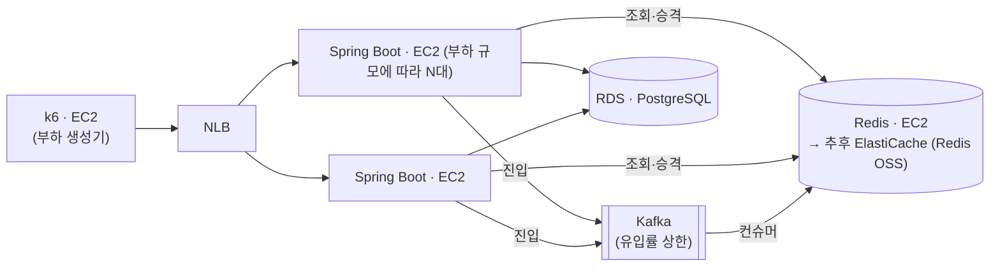

# 명절 승차권 예매

## 요약
명절 열차 승차권 예매처럼 특정 시각에 수백만 명이 동시에 몰리는 상황을 가정하고 대기열 시스템을 설계한 프로젝트입니다.
아키텍처 변경 전후의 성능 차이를 동일한 조건에서 비교하고 검증하는 데 목적을 두었습니다.

사용자는 대기열 진입 → 순번 조회 → 입장 → 예약 단계를 거치며, 각 단계는 다음과 같이 설계했습니다.

| 단계    | 설계 방식                                        | 설계 이유                                             |
| ------ | -------------------------------------------- | ------------------------------------------------- |
| 진입    | Kafka로 요청을 수집하고, 컨슈머가 일정 속도로 Redis 대기열에 등록   | 예매 시작 직후 수백만 건의 진입 요청이 Redis에 직접 몰리면 기존 대기자의 순번 조회까지 지연될 수 있음. 진입 요청을 Kafka에 먼저 적재해 Redis 유입률을 제어함으로써 조회가 밀려나는 폭을 제한함       |
| 순번 조회 | 클라이언트 폴링 방식 사용, 다음 조회 시점을 서버가 순번에 따라 동적으로 결정 | WebSocket, SSE는 대규모 연결 유지 비용이 발생함. 대기열 특성상 뒤쪽 사용자는 앞이 다 빠지기 전까지 답이 같으므로, 후순위 사용자일수록 조회 주기를 늘려 불필요한 Redis 조회를 줄임       |
| 입장    | 초당 처리량이 아닌 활성 사용자 수를 기준으로 입장 제어              | 예약 처리 시간은 사용자마다 달라 TPS만으로는 실제 부하를 반영하기 어려움. 현재 시스템이 처리 중인 활성 사용자 수를 기준으로 입장시켜 예약 서버가 동시에 처리할 인원에 상한을 둠       |
| 예약    | 예약 데이터는 PostgreSQL에 저장하고 Redis에는 대기 상태만 유지  | Redis는 대기열 제어를 위한 일시적 상태 저장소로 사용하고, 실제 예약 결과는 PostgreSQL에 저장해 Redis 장애나 재시작 시에도 예약 데이터의 영속성과 정합성을 보장함       |

### 측정 요약

- WAS 1~8대 수평 확장에 처리량 17,313 → 138,548 req/s, **8.00배**로 선형 증가
- 1~2대는 WAS CPU 포화(93~96%)가 병목, 8대에서 Redis CPU 100% 도달 — 병목이 Redis로 이동
- 8대 처리량은 Redis 단독 실측치(`redis-benchmark` 139,912 req/s)의 **99.0%** — 상한을 정하는 것은 앱이 아니라 Redis 한 대
- Kafka 경유 진입은 처리량을 올리지 못했지만, 진입 스파이크 중 순번 조회 p95를 195.68ms → 28~32ms로 낮춤(84% 감소)
- 200만 건 진입에서 순번 유실·중복 없음. 추가 처리량 확보에는 Redis 분산 구조가 필요

## 프로젝트 배경 및 목적
명절 승차권 예매 환경을 가정한 대규모 예약 시스템입니다.

동시 접속자가 급증할 때 대기열, 예약 처리, DB, 캐시 구조가 성능에 어떤 영향을 주는지 확인하려고 만들었습니다.

기능 완성이 아니라 병목 구간을 찾고, 아키텍처 변경 전후의 처리량(TPS), 응답 시간, 자원 사용량을 측정해 비교하는 것을 목표입니다.

## 문제 정의
명절 승차권 예매는 특정 시각에 대규모 사용자가 동시에 접속하는 특성을 가졌습니다.

평일 예매와 달리 사용자가 좌석을 선택하거나 결제를 진행하지 않고 열차 단위로 예약을 수행합니다. 
이는 제한된 시간 내에 최대한 많은 예약 요청을 처리해야 하는 명절 예매의 특성상 좌석 선택 및 결제 과정에서 발생하는 추가적인 동시성 문제와 처리 지연을 최소화하기 위한 설계라고 판단했습니다.

그래도 수많은 사용자가 동시에 예약을 시도하기 때문에 다음과 같은 문제가 발생합니다.

- 순간 트래픽 증가로 인한 서버, DB 과부하
- 동일 열차에 대한 예약 요청 처리
- 잔여 좌석 수량 관리 및 데이터 정합성
- 장애 시 예약 데이터의 일관성 유지

이 문제를 재현하고 대기열, 캐시, 동시성 제어 전략이 성능과 안정성에 미치는 영향을 검증합니다.

## 설계

### Redis 기반 대기열
대기열은 요청을 순서대로 처리하는 것만으로는 부족하고, 다음 기능이 필요합니다.

- 빠른 대기열 진입
- 전체 대기 순번 조회
- 특정 사용자의 순번 조회
- 실시간 입장 처리

Kafka는 대규모 이벤트 처리에 적합하지만 사용자의 현재 대기 순번을 실시간으로 조회할 수 없습니다.
Redis의 Sorted Set은 순번 조회와 대기열 크기 조회를 모두 O(logn)에 처리합니다.

여기에 정원 확인 → 승격 → 만료 설정은 원자적이어야 합니다.
중간에 다른 요청이 끼어들면 활성 사용자 수가 실제 정원과 어긋나기 때문입니다.
Redis는 단일 스레드에서 Lua Script를 실행해 이를 보장합니다.

### 대기열 상태 조회
대기 순번은 클라이언트가 폴링하여 조회합니다.

WebSocket, SSE는 사용자마다 연결을 유지해야 해서 대기 인원이 늘어난 만큼 서버의 메모리와 소켓 자원을
계속 점유합니다. 폴링은 요청이 끝나면 연결도 끝나고, 조회 한 번이 Redis 명령 두어 개로 끝납니다.
대기 순번은 수 초 이내의 지연을 허용할 수 있어 서버 자원 효율과 안정성을 택했습니다.

다만 폴링은 1인당 N회라 요청 **총량**이 문제가 됩니다.
모두에게 같은 주기를 주면 만 명이 약 2,000 rps, 200만 명이면 40만 rps입니다.
조회 주기에 랜덤 지연(Jitter)을 더해 요청이 한 시점에 몰리는 것은 막았지만,
지터는 요청을 시간축에 흩을 뿐 총량을 줄이지 않습니다.

그래서 순번에 따라 조회 주기를 다르게 줍니다. 내 차례까지 남은 시간을 네 번에 나눠 묻도록
정하니 순번이 뒤일수록 주기가 길어지고, 5초와 30초 사이로 자릅니다. 계산은 서버가 해서
응답에 실어 보냅니다. 200만 명이 대기하면 조회 총량이 약 70,000 rps입니다.

### 활성 사용자 수 기반 입장 제어
입장은 일정 주기마다 N명을 통과시키는 대신 활성 사용자 수를 기준으로 제어합니다.

활성 사용자는 Redis Sorted Set으로 관리하고 score에 만료 시각을 저장했습니다. 만료된 사람은
그 시각 범위로 한 번에 지우고, 현재 인원은 개수만 세면 됩니다. 만료 시각을 score 하나로 두니
활성 사용자 정리와 정원 계산이 같은 자료로 해결됩니다.

초당 N명 방식은 유입 속도만 제한할 뿐 시스템이 실제로 처리 중인 인원은 통제하지 못합니다.
활성 사용자 수를 기준으로 하면 로그인, 예약, DB가 동시에 처리해야 하는 인원에 상한을 둘 수 있습니다.

### 배치 승격 상한 설정
대기열 승격은 Redis Lua Script로 처리하되, 한 번에 승격할 인원 수에 상한을 두었습니다.

스크립트가 실행되는 동안에는 다른 요청이 끼어들 수 없어 원자성을 얻지만,
반대로 실행 시간이 길어지면 그만큼 다른 요청도 함께 대기합니다.
그래서 정원이 한꺼번에 비더라도 전부 즉시 승격하지 않고 일정 인원 단위로 나누어 처리합니다 —
원자성은 유지하면서 특정 시점에 Redis 부하가 몰리는 것을 막았습니다.

### Kafka를 거치는 진입

진입은 Kafka에 넘기고, 컨슈머가 정해진 속도로만 Redis에 넣습니다(`queue.enqueue-via-kafka`).

**처리량을 올리려고 넣은 것이 아닙니다.** 버퍼는 도착분을 시간축으로 미룰 뿐 명령 처리량을 올리지
못하고, 이 앱에는 이미 버퍼가 있습니다 — 가상 스레드라 톰캣이 넘치는 대신 계속 accept하고 안에서
줄을 섭니다(아래 「정합성과 과부하 거동」).

넣은 이유는 **우선순위 분리**입니다. `enqueue.lua`와 `status.lua`는 Redis 단일 스레드를 공유하므로,
개시 순간의 진입 스파이크가 Redis를 포화시키면 그 지연이 진입에 머물지 않고 **이미 줄 서 있는
사람들의 순번 조회로 번집니다.** `max-batch`·`max-sweep`은 스케줄러 쪽 스파이크만 막고, 진입과 조회
사이에는 아무 장치가 없었습니다. 유입률에 상한을 두면 그만큼이 폴링에 남습니다.

상한값은 위에서 구한 폴링 총량에서 나옵니다 — 약 140,000 rps 중 조회가 최대 약 70,000을 쓰므로
진입 몫이 60,000~70,000이고, 150만 명이면 개시 후 약 25초에 전원 등록이 끝납니다.

이 상한은 **인스턴스 안에서만** 지켜집니다. 컨슈머가 대마다 돌고 속도 제한도 대마다 있으므로,
WAS를 N대로 늘리면 Redis가 받는 실효 유입률도 N배입니다. 설정값을 대수로 나눠 넣어야 하고,
파티션 수도 전체 컨슈머 스레드 수와 맞춰야 합니다 — 둘 다 빠뜨려도 기동은 성공하기 때문에
확인은 실효 유입률로 합니다(아래 「진입 스파이크가 조회로 번지는 정도」).

대가로 **전역 전순서를 포기했습니다.** 파티션이 여럿이고 컨슈머가 병렬이라 seq 발급 순서가 접수
순서와 어긋납니다. 어차피 클라이언트 → NLB → WAS 도착 순서가 네트워크 지연·재시도로 섞여 있어
서버가 받은 순서는 사용자가 버튼을 누른 순서가 아닙니다 — 전순서는 이미 명목적이라고 보고 고른
교환입니다. 강한 보장이 필요한 곳은 순번이 아니라 정원이고, 정원은 그대로 원자적입니다.

Kafka는 내구성 때문에 넣은 것이 아니라, 브로커가 죽으면 대기열이 유실되는 것은 아래 Redis 영속성을
끈 결정과 같은 선택입니다.

#### 접수와 등록 사이의 공백

진입 응답이 201이 아니라 **202**입니다. 아직 대기열에 등록되지 않았으므로 순번도 없습니다.
그 사이에 순번을 물어보면 어느 ZSet에도 없어 `status.lua`가 만료와 구별할 수 없는데, 구별하려고
접수된 토큰을 Redis에 따로 적으면 유입률에 상한을 걸려던 목적과 정면으로 어긋납니다.

그래서 **접수 시각을 토큰에 실었습니다**. 서버는 Redis를 한 번도 더 읽지 않고 "아직 등록 전"(PENDING)과
"만료됐거나 없는 토큰"을 가릅니다. 판정 기준은 컨슈머의 폐기 기준(`stale-after`)과 같은 값이라,
컨슈머가 이미 버렸는데 화면은 계속 기다리는 일이 없습니다.

컨슈머가 밀린 사이에 창을 닫은 사람은 뒤늦게 넣지 않고 버립니다. 그대로 넣으면 폴링하지 않는 유령이
쌓이고 스위퍼가 `poll-grace`를 기다린 뒤에야 걷어내는데, 그동안 내내 뒷사람의 순번이 실제보다 뒤로
밀립니다. 버린 수는 `queue.enqueue.dropped`로 나갑니다 — 조용히 버리면 202를 받았는데 대기열에
없는 사람이 생기고 원인을 찾을 수 없습니다.

첫 조회 기한은 접수 시각이 아니라 **등록 시각**으로 다시 찍습니다. 접수 시각으로 계산한 기한을
넘겨받으면 컨슈머가 밀린 만큼 그 기한이 이미 지나 있어, 등록되는 순간 회수 대상이 됩니다.

#### 플래그로 남긴 도입 전 경로

`queue.enqueue-via-kafka`를 false로 두면 도입 전과 같은 경로입니다. Kafka 설정 블록도 읽히지 않고
브로커도 필요 없습니다. **같은 jar에서 플래그만 바꿔 전후를 재기 위한 것입니다** — 따로 빌드해서
재면 빌드·세션이 바뀌는 변수가 한꺼번에 섞입니다.

Redis에 넣는 방법은 두 경로가 완전히 같습니다. 컨슈머도 결국 직접 진입과 같은 코드를 부르므로,
스크립트도 인자도 갈라지지 않고 다른 것은 그 호출이 요청 스레드에서 일어나는지 컨슈머에서
일어나는지 하나뿐입니다.

### Redis 장애 대응
대기열은 Redis에 저장하지만, Redis를 영구 데이터 저장소로 쓰지는 않습니다.

예약 데이터는 PostgreSQL에 저장하고 Redis에는 현재 대기 상태만 관리합니다.
따라서 Redis 장애 시 대기열은 유실될 수 있지만 예약 데이터에는 영향이 없습니다.
일부만 복구된 대기열보다 명확하게 초기화된 대기열이 운영 측면에서 안전하다고 판단해
Redis 영속성은 비활성화했습니다.

## 동작 흐름

| 단계 | 설명 |
|---|---|
| 진입 | 순번을 발급받아 대기열에 등록하고, 첫 조회 기한을 함께 찍는다 |
| 진입(Kafka 경유) | 접수만 하고 202로 돌려준다. 컨슈머가 정해진 속도로 위의 등록을 대신 수행한다 |
| 접수 확인 | 등록 전에 순번을 물으면 "배정 중"을 돌려준다. 판정은 토큰에 실린 접수 시각으로 한다 |
| 순번 조회 | 내 순번·전체 인원과 다음 조회까지 기다릴 시간을 돌려준다. 조회 자체가 살아 있다는 신호가 된다 |
| 이탈 | 창을 닫으면 대기열과 조회 기한에서 함께 빠진다 |
| 이탈 회수 | 조회 기한이 지나도록 소식이 없는 대기자를 이탈로 보고 줄에서 걷어낸다 |
| 승격 | 만료된 활성 사용자를 회수하고, 빈 정원만큼 대기열 앞에서부터 활성으로 올린다 |
| 입장 확정 | 실제로 입장한 사람의 만료 시각을 세션 길이로 다시 찍는다 |
| 로그인 | 같은 방식으로 만료 시각을 예매 제한 시간까지 늘린다 |
| 화면 진입 게이트 | 쿠키의 존재가 아니라 활성 목록의 만료 시각을 보고 통과 여부를 정한다 |
| 로그아웃 | 활성 목록에서 빼 자리를 반납한다 |

## 인프라 아키텍처



진입만 Kafka를 거칩니다. 조회는 응답에 순번을 담아 돌려줘야 하는 동기 요청이라 큐에 넣을 수 없고
(게다가 조회 자체가 폴링 기한을 찍는 쓰기입니다), 승격·회수·만료 갱신은 초당 한 자리~수 회라
조절할 대상이 아닙니다. 그래서 Kafka가 막는 것은 **개시 순간의 진입 스파이크가 조회를 밀어내는 것**
하나입니다 — 조회 자체가 Redis를 포화시키는 규모가 되면 Kafka는 무력하고 그때는 Redis 측 분산뿐입니다.

| 구성 | 설명 |
|---|---|
| k6 · EC2 | 부하 생성기. WAS와 같은 머신에 두면 측정 대상이 아니라 생성기를 재게 되므로 따로 뗀다 |
| NLB | L4 로드밸런서. HTTP를 파싱하지 않아 측정에 얹는 변수가 가장 적다. 기준선에는 넣지 않고, NLB가 얹는 비용은 따로 잰다 |
| Spring Boot · EC2 | 애플리케이션. 다중화하려면 세션을 Redis로 빼고 승격 스케줄러를 한 대에서만 돌려야 한다 |
| Redis · EC2 | 대기열의 진실 원천. CPU·메모리·버전을 직접 통제해야 측정이 재현되므로 관리형 대신 EC2에 둔다 |
| RDS · PostgreSQL | 예약 데이터 저장소. 대기열 hot path에 걸리지 않아 관리형으로 충분하다 |
| 배치 | 넷을 전부 같은 AZ·서브넷에 둔다. 왕복 지연이 그대로 측정값에 섞이기 때문이다 |

인스턴스 타입·보안 그룹과 부트스트랩·측정 스크립트는 [infra/aws](infra/aws)에 있습니다.

## 측정 결과

### 테스트 환경

| 항목 | 값 |
|---|---|
| WAS | `c8g.large` (2 vCPU, 4 GiB) 최대 8대, Corretto 21.0.12 |
| Redis | `c8g.large` (2 vCPU, 4 GiB), Redis 8.0.5 |
| Kafka | `c8g.xlarge` (4 vCPU), Kafka 4.2.1 KRaft 단일 브로커 |
| RDS | `db.t4g.micro` |
| 로드밸런서 | Network Load Balancer (TCP:8080) |
| k6 | `c8g.8xlarge` (32 vCPU, 64 GiB) · k6 v2.1.0 |
| OS | Ubuntu 26.04 arm64 |
| 부하량 | 대기열 진입 API 150만 건(워밍업 제외) |

#### 부하 생성기와 연결 조건

생성기 크기와 연결 재사용은 재는 대상이 아니라 **재는 방법**인데, 어긋나면 서버가 달라진 것처럼
보입니다. 같은 8대 구성에서 세 조건이 이만큼 갈립니다.

| 조건 | 처리량 | Redis CPU | WAS CPU | k6 CPU |
|---|---|---|---|---|
| 8xlarge · 연결 재사용 | **136,069 req/s** | 96.7% | 96% | 54% |
| 8xlarge · `NO_REUSE=1` | 94,057 req/s | 67.8% | 97% | 63% |
| 2xlarge · `NO_REUSE=1` | 44,000 req/s | 39.8% | — | **99.3%** |

연결 재사용을 끄면 **병목 위치 자체가 Redis에서 WAS로 옮겨가고**, 생성기를 줄이면 생성기가 먼저
포화해 서버가 한가한 채로 측정이 끝납니다. 둘 다 설계가 아니라 재다가 걸린 것입니다.
아래 값은 전부 첫 줄 조건입니다 — `NO_REUSE=1`이 실제 오픈 순간에 더 가깝지만, Redis 경합을 재는
것이 목적일 때는 Redis가 포화되는 쪽을 써야 합니다.

### WAS 증설에 따른 병목 이동

| 구성 | 처리량 | 1대 대비 | p99 | WAS CPU (대당) | Redis CPU |
|---|---|---|---|---|---|
| 1대 | 17,313 req/s | 1.00× | 107.5ms | **96.4%** | 14.7% |
| 2대 | 36,902 req/s | 2.13× | 58.2ms | **93.3%** | 30.3% |
| 8대 | **138,548 req/s** | **8.00×** | 14.5ms | 73% | **100~110%** |

1·2대는 WAS 포화(93~96%)가 병목이라 Redis(14.7~30.3%)는 여유가 있었지만, 8대에서는 WAS가 73%로
내려가고 Redis가 100%를 넘깁니다 — 병목이 넘어갔고 **9대째를 붙여도 얻을 게 없습니다.**
Redis는 단일 스레드라 코어를 더 줘도 명령 처리량이 늘지 않습니다(100% 초과분은 `UNLINK`의
lazy-free 같은 백그라운드 스레드 몫입니다).

1대→2대의 2.13배는 1대가 이미 비효율 구간이었기 때문입니다 — closed 모델에서 처리량은
`VUS ÷ 응답시간`이라(1000 ÷ 0.0577s = 17,331로 실측과 일치), 배율의 정체는 응답시간이
절반 이하로 떨어진 것입니다.

### Redis 처리량 한계 검증

8대의 138,548 rps는 앱을 빼고 같은 [`enqueue.lua`](server/src/main/resources/redis/enqueue.lua)를
`redis-benchmark`로 직접 잰 139,912 rps의 **99.0%**입니다. 앱 쪽에 짜낼 것이 1% 남았다는 뜻이고,
이 구성의 상한을 정하는 것은 애플리케이션이 아니라 **Redis 한 대**입니다 — 넘기려면 WAS 증설도
앱 최적화도 아닌 Redis 측 분산(키 분리·클러스터)뿐입니다. 기준값은 앱과 같은 150만 깊이에서
재야 합니다. 20만 깊이로 재면 148,367로 5.7% 후하게 나옵니다([k6/redis-baseline.sh](k6/redis-baseline.sh)).

### 진입 스파이크가 조회로 번지는 정도

Kafka를 넣은 이유가 우선순위 분리라면, 재야 할 것은 처리량이 아니라 **진입 스파이크가 이미 줄 서
있는 사람의 조회 지연을 얼마나 밀어올리는가**입니다. [k6/mixed.js](k6/mixed.js)가 폴링과 스파이크를
한 런의 두 executor로 돌리고 조회 지연을 스파이크 전(`quiet`)·중(`spike`)으로 갈라 태그합니다 —
기준선을 같은 런에서 뽑아야 JIT·페이지 캐시가 섞이지 않습니다.

측정 조건: 깊이 50만 · 폴링 5,000명 · 스파이크 200,000/s × 15초(처리 능력 위)

| 지표 | Kafka **off** | Kafka **on** ①  | Kafka **on** ② |
|---|---|---|---|
| 조회 p95 `quiet` | 976 µs | 1.08 ms | 1.02 ms |
| 조회 p95 `spike` | **195.68 ms** | **31.83 ms** | **28.52 ms** |
| **번짐 배수** | **200×** | **29.5×** | **28.0×** |
| 실효 유입률(중앙값) | 124,297/s | 59,332/s | 59,044/s |
| `queue.enqueue.dropped` | 0 | 0 | 0 |

스파이크가 조회 p95를 **200배**로 밀어올리던 것이 **28~30배**로, 절대값으로는 195.68ms → 28~32ms로
**84% 감소**했습니다. 기준선(`quiet`)은 세 런이 1ms 안팎으로 같아 비교가 성립합니다.

실효 유입률은 설정값 60,000/s의 **98.4~98.9%**에 붙고 두 런의 편차가 0.5%입니다 — 상한이 실제로
걸렸다는 뜻이고, 이 값 하나가 인스턴스당 상한(`60000 ÷ 8`)과 파티션 수(8대 × 4 = **32**)를 동시에
검증합니다. 어긋났을 때 어떤 값이 나오는지는 [infra/aws/README.md](infra/aws/README.md#읽는-법)에
있습니다. 브로커는 병목이 아니었습니다 — 4 vCPU에서 CPU 26.2%, `usec_per_call`도 Kafka를 거치지
않을 때(5.58μs)와 같은 자리(5.88~6.05μs)입니다.

#### 이 수치가 말하지 않는 것

**폴링 규모가 실제에 못 미칩니다.** 폴링 5,000명은 초당 조회 수로 환산하면 위 「대기열 상태 조회」의
약 70,000 rps에 한참 못 미칩니다. k6는 VU 하나가 실제 연결 하나라 200만 명이 폴링하는 상황을
그대로 만들 수 없습니다. 여기서 확인한 것은 **상한이 걸린다는 것과 그때 조회 지연이 줄어드는
방향**이지, 실제 명절 트래픽에서의 절대값이 아닙니다.

셋은 계산·추론으로 대신했습니다 — 최대 부하 런의 `ops/sec` 피크, `mixed` 런의 Redis 포화 여부,
파티션별 메시지 분포. 다시 재는 방법은 [infra/aws/README.md](infra/aws/README.md#다음에-채울-측정)에 있습니다.

### 정합성과 과부하 거동

모든 런에서 다음 넷이 성립했습니다.

```
seq == 보낸 요청 수(또는 성공한 201 수)     순번 유실도 중복도 없음
ZCARD waiting + ZCARD active == seq
ZCARD active <= queue.capacity(1000)        정원이 새어나가지 않음
http_req_failed == 0.00%
```

`seq`가 정확히 맞는다는 것은 초당 13.8만 건이 쏟아지는 동안에도
[`enqueue.lua`](server/src/main/resources/redis/enqueue.lua)가 `INCR`과 `ZADD`를 하나로 묶은 것이
지켜졌다는 뜻입니다. Kafka를 거치면 접수와 등록 사이에
컨슈머가 있어 첫 줄만 `seq == 202 응답 수 - queue.enqueue.dropped`로 바뀌는데, 실측에서 `dropped`는
8대 합산 0이었습니다 — 등록이 접수보다 30초 넘게 밀리는 동안에도 버려진 것이 없었습니다.

**과부하에서는 거부하지 않고 느려집니다.** 도착률을 처리 능력 위로 밀어도
`TcpExtListenOverflows`·`ListenDrops`·`TCPReqQFullDrop`이 8대 전부 런 내내 0이었고,
`server.tomcat.accept-count: 1000`을 한 번도 넘기지 않았습니다. 가상 스레드라 톰캣이 넘치는 대신
계속 accept하고 안에서 줄을 섭니다. 초과분은 서버 거부가 아니라 부하 생성기 쪽
`dropped_iterations`로 나타납니다.

### 설계 결정 검증

위 섹션에서 다루지 않은 결정들의 확인값입니다.

| 결정 | 확인된 값 |
|---|---|
| **Redis + Lua 원자 연산** | `usec_per_call`이 5.51 → 5.65μs로 부하가 8배 되는 동안 2.5%만 증가 |
| **NLB(L4) 선택** | 우회 17,420 vs 경유 17,313 — **0.6%**로 런 간 편차와 구분되지 않음 |
| **ZSet 하나로 대기열 관리** | 1인당 **276 B**(150만 명에 413.9MB, 200만이면 약 552 MiB). 4 GiB 인스턴스에서 메모리는 상한이 아니었고, 먼저 막힌 것은 CPU |
| **세션 외부화 · 스케줄러 단일화** | 8대에서 WAS1만 `queue.promoted > 0`, 나머지 7대 정확히 0 |
| **배치 승격 상한(`max-batch`)** | 승격이 몰리는 순간에도 Redis `usec_per_call`이 흔들리지 않음 |

### 측정하면서 찾아낸 문제

측정 조건 둘은 위 「부하 생성기와 연결 조건」에 있고, 나머지는 스크립트 결함이었습니다. 넷 다
**오류가 아니라 조용한 어긋남**이라 로그에 남지 않습니다.

| 문제 | 증상 | 원인 |
|---|---|---|
| 브로커 힙이 안 고정됨 | `-Xmx2g`가 적용되지 않음 | systemd `Environment=`가 공백에서 다음 할당으로 넘어간다. 따옴표가 없으면 뒤가 버려지는데, `xlarge`에서는 기본값이 마침 2g라 티가 안 난다 |
| 워밍업이 안 버려짐 | Kafka를 켠 런만 깊이가 두 배(1,035,346) | 초기화가 Redis만 지우는 사이 브로커에 남은 워밍업이 그 뒤에 들어온다. 지우기 전에 드레인을 기다려야 한다 |

이 둘을 고치기 전 런은 Kafka를 켠 쪽만 깊이가 달라 위 「진입 스파이크」 표의 비교가 성립하지
않았습니다.

## 참고

| 문서 | 내용 |
|---|---|
| [Redis 싱글 스레드](docs/redis-single-thread.md) | 왜 한 스레드로 도는지, 그 전제가 이 프로젝트의 상한(약 14만 rps)으로 어떻게 나타나는지 |
