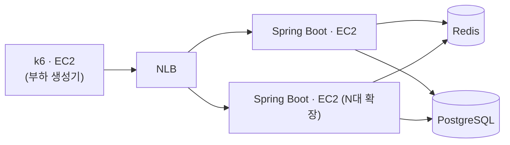

# 대규모 예약 시스템 대기열 설계 및 성능 검증

명절 승차권 예매처럼 특정 시각에 수백만 요청이 몰리는 상황을 가정하여 Redis 기반 대기열을 설계하고, 150만 요청 환경에서 처리 한계와 병목 지점을 검증한 프로젝트입니다.

## 요약

- Redis ZSet + Lua 기반 대기열 구현
- 150만 건 진입 테스트에서 순번 유실·중복 없이 동작 검증
- WAS 확장을 통해 처리량을 138,548 req/s까지 증가
- Redis Benchmark 대비 99.0% 수준으로 Redis 단일 노드 처리 한계 확인
- Redis Cluster 기반 확장 구조 설계 및 Failover 검증

## 검증 범위

대기열 진입, 순번 조회, 입장 제어 과정과 Redis 단일 노드의 처리 한계를 검증했습니다.

좌석 선택, 결제, 회원가입 과정은 제외하고 대기열 처리 성능 검증에 집중했습니다.

## 아키텍처

## 설계

| 문제 | 선택 | 이유 |
|--------|--------|--------|
| 대기열 저장소 | Redis ZSet | 대기열 진입, 전체 순번 조회, 특정 사용자 순번 조회, 입장 처리를 하나의 자료구조에서 처리하기 위해 선택 |
| 활성 사용자 관리 | 만료 시각 기반 ZSet | 예약 처리 시간을 고려해 TPS가 아닌 활성 사용자 수 기준으로 입장 제어하기 위해 선택 |
| 원자성 보장 | Lua Script | 정원 확인, 승격, 만료 설정 사이에 다른 요청이 끼어들어 정원이 초과되는 상황을 방지하기 위해 선택 |
| 상태 조회 | Polling | WebSocket·SSE의 연결 유지 비용을 피하고, 순번에 따라 조회 주기를 다르게 제어하기 위해 선택 |
| 확장 구조 | Redis Cluster | 단일 Redis 처리 한계를 확인한 후 처리량 확장과 장애 대응을 위해 선택 |

## 성능 측정

### 측정 환경

| 항목 | 값 |
|--------|--------|
| WAS | c8g.large (2 vCPU, 4 GiB) 최대 8대 |
| Redis | c8g.large (2 vCPU, 4 GiB) |
| RDS | db.t4g.micro |
| Load Balancer | NLB |
| 부하 생성기 | c8g.8xlarge |
| 부하량 | 대기열 진입 API 150만 건 |

### WAS 확장에 따른 처리량 변화

| 구성 | 처리량 | p99 |
|--------|--------:|--------:|
| 1대 | 17,313 req/s | 107.5ms |
| 2대 | 36,902 req/s | 58.2ms |
| 8대 | 138,548 req/s | 14.5ms |

#### 관찰 결과

- 1~2대 구간에서는 WAS CPU 사용률이 90% 이상으로 WAS가 병목
- Redis가 포화되기 전까지 WAS 수평 확장에 따라 처리량 증가
- 8대 시점부터 Redis CPU가 포화되며 병목이 Redis로 이동
- 이후 WAS를 추가해도 처리량 증가는 거의 발생하지 않음

### Redis 단일 노드 한계 측정

동일한 Lua 스크립트를 애플리케이션 없이 `redis-benchmark`로 직접 측정했습니다.

| 구분 | 처리량 |
|--------|--------:|
| 애플리케이션 전체 | 138,548 req/s |
| Redis Benchmark | 139,912 req/s |

애플리케이션 처리량은 Redis Benchmark 결과의 99.0% 수준이었습니다.

즉, 이 시점의 병목은 Spring Boot나 네트워크가 아니라 Redis 단일 노드 자체였습니다.

## 정합성 검증

대기열 진입과 입장 처리 과정에서 동시 요청으로 인한 순번 오류와 정원 초과가 발생하지 않는지 검증했습니다.

150만 건 진입 테스트에서 다음을 확인했습니다.

- 순번 유실 0건
- 순번 중복 0건
- 활성 사용자 정원 초과 0건

## Redis Cluster 구조 설계

단일 Redis의 처리 한계를 확인한 후 Redis Cluster 구조로 확장했습니다.

- Master 3 + Replica 3 구성
- Hash Tag 기반 샤드 분산
- Lua Script 원자성 유지
- 자동 Failover 검증 완료

트레이드오프는 전역 순번을 정확하게 계산할 수 없다는 점입니다.

대신 샤드별 순번을 기반으로 근사 순번을 계산하여 사용했습니다.

## 문서

| 문서 | 내용 |
|--------|--------|
| [docs/redis-single-thread.md](docs/redis-single-thread.md) | Redis 단일 스레드 구조와 처리 한계 |
| [docs/redis-topology.md](docs/redis-topology.md) | Standalone, Replication, Sentinel, Cluster 비교 |
| [docs/redis-cluster-bootstrap.md](docs/redis-cluster-bootstrap.md) | Redis Cluster 구축 및 Failover 실습 |