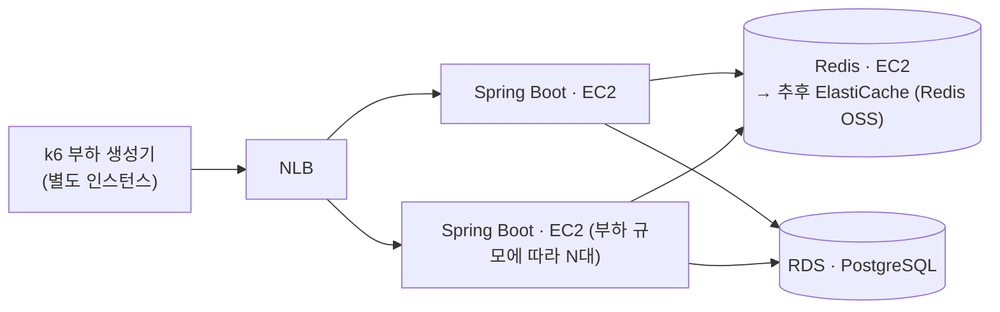

# 명절 승차권 예매

> 명절 예매급 순간 트래픽을 대기열 기반 입장 제어로 감당하는 대규모 시스템 — 병목을 직접 측정하며 설계.
> Spring Boot 4 · Java 21 · Redis 8 · PostgreSQL 18 · k6

## 프로젝트 배경 및 목적

명절 승차권 예매 환경을 가정한 대규모 예약 시스템입니다.

동시 접속자가 급증하는 상황에서 대기열, 예약 처리, 데이터베이스, 캐시 구조가 시스템 성능에 어떤 영향을 주는지 확인하기 위해서 개발을 했습니다.

단순 기능 구현보다 병목 구간을 찾고, 아키텍처 변경 전후의 처리량(TPS), 응답 시간, 자원 사용량을 측정하고 비교하 것을 목표로 합니다.

## 문제 정의
명절 승차권 예매 서비스는 특정 시각에 대규모 사용자가 동시에 접속하는 특성을 가진 서비스입니다.

평일 승차권 예매 시스템과 달리 사용자가 좌석을 선택하거나 결제를 진행하지 않고 열차 단위로 예약을 수행합니다. 이는 제한된 시간 내에 최대한 많은 예약 요청을 처리해야 하는 명절 예매의 특성상 좌석 선택 및 결제 과정에서 발생하는 추가적인 동시성 문제와 처리 지연을 최소화하기 위한 설계라고 판단했습니다.

그럼에도 불구하고 수많은 사용자가 동시에 예약을 시도하기 때문에 다음과 같은 문제가 발생합니다.

- 순간적인 트래픽 증가로 인한 서버 및 DB 과부하
- 동일 열차에 대한 예약 요청 처리
- 잔여 좌석 수량 관리 및 데이터 정합성 보장
- 장애 발생 시 예약 데이터의 일관성 유지

실제 명절 승차권 예매 환경을 기반으로 이러한 문제를 제현하고 대기열, 캐시, 동시성 제어 전략이 시스템 성능과 안정성에 미치는 영향을 검증하는 것을 목표로 합니다.

## 설계

### 1. 대기열은 왜 Redis인가 (vs Kafka)
대기열은 단순히 요청을 순서대로 처리하는게 아니라 다음 기능을 제공해야 합니다.

- 빠른 대기열 진입
- 전체 대기 순번 조회
- 특정 사용자의 순번 조회
- 실시간 입장 처리

Kafka는 대규모 이벤트 처리에는 적합하지만 사용자의 현재 대기 순번을 실시간으로 조회하는 기능은 제공하지 않습니다. 
반면 Redis의 Sorted Set은 순번 조회, 대기열 크기 조회를 모두 O(logn) 수준으로 처리할 수 있습니다.

대기열은 단순히 조회만 수행하는 것이 아니라 정원확인 → 승격 → 만료시간 설정을 원자적 작업으로 처리를 해야합니다.
중간에 다른 요청이 끼어들면 정원 수가 어긋날 수 있기 때문입니다.
Redis는 단일 스레드와 Lua Scirpt를 통해 이러한 작업을 원자적으로 처리할 수 있습니다.

### 2. 대기열 상태 조회 폴링에 지터를 적용
대기 순번은 클라이언트가 주기적으로 폴링하여 조회하도록 구현을 했습니다.

WebSocket, SSE는 사용자마다 연결을 유지해야 하므로, 대기 인원이 많아질수록 서버의 메모리와 소켓 자원을 지속적으로 점유합니다. 
반면에 폴링은 요청이 끝나면 연결도 종료되어 서버가 연결을 유지할 필요가 없으며, 조회도 Redis 읽기 한번으로 처리되어 부담이 크지 않습니다.

또한 모든 클라이언트가 동일한 주기로 요청하면 특정 시점에 트래픽이 집중될 수 있어, 조회 주기에 작은 랜덤 지연(Jitter)을 추가해 요청을 분산했습니다.
대기 순번은 실시간성이 크게 중요하지 않아 수 초 이내의 조회 지연을 허용할 수 있으므로, 서버 자원 효율과 안정성을 우선해 폴링 방식을 선택했습니다.

## 인프라 아키텍처

측정이 목적인 시스템이라, 컴포넌트를 분리해 병목을 각각 따로 관찰할 수 있게 배치합니다.

- **Spring Boot(WAS)는 EC2에서 실행하고, 부하 규모에 따라 여러 대로 늘려 앞단에 NLB를 둡니다.**
  대기열 진입·조회 경로가 사실상 얇은 Redis 프록시라 요청당 지연에 민감한데, L4인 NLB는 HTTP
  파싱 없이 통과시켜 측정에 얹는 변수가 가장 적습니다. 명절 rush 같은 순간 급증도 사전 워밍업 없이
  받아냅니다. 경로 라우팅·WAF 같은 L7 기능이 필요해지면 그때 ALB를 재검토합니다.
- **부하 생성기(k6)는 WAS와 분리합니다.** 같은 머신에서 CPU를 나눠 쓰면 측정 대상이 아니라
  생성기를 측정하게 됩니다.
- **DB는 RDS의 PostgreSQL을 사용합니다.** 계정·예약 테이블뿐이라 진입 hot path엔 걸리지 않아
  관리형으로 운영 부담을 덜되, 다음 좌석 페이즈의 배타 제약(EXCLUDE + GiST)·MVCC를 위해 엔진은
  PostgreSQL을 유지합니다.
- **Redis는 EC2에서 실행합니다.** 대기열의 진실 원천이라 CPU·메모리·버전을 직접 통제해 재현성을
  지킵니다. 추후 **ElastiCache(Redis OSS)**로 옮겨 관리형과 자체 호스팅의 처리량·지연을 비교할 수
  있습니다.

다중 WAS로 확장할 때는 두 가지가 선행되어야 합니다. 톰캣 인메모리 세션을 Redis로 외부화하고
(`spring-session-data-redis`), 승격 스케줄러를 단일화합니다 — 인스턴스마다 돌면 승격 배치가
N배가 되기 때문입니다. 근거는 [설계 상세](docs/design.md)에 있습니다.

## 동작 흐름

## 측정 결과

## 더 읽기
