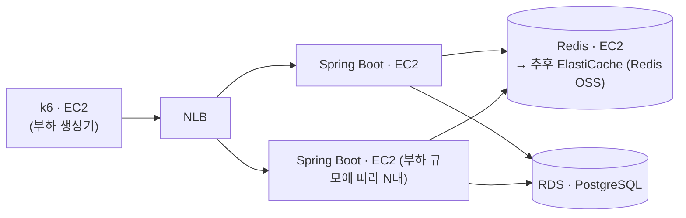

# 명절 승차권 예매

> Spring Boot 4 · Java 21 · Redis 8 · PostgreSQL 18 · k6

## 프로젝트 배경 및 목적


명절 승차권 예매 환경을 가정한 대규모 예약 시스템입니다.

동시 접속자가 급증하는 상황에서 대기열, 예약 처리, 데이터베이스, 캐시 구조가 시스템 성능에 어떤 영향을 주는지 확인하기 위해서 개발을 했습니다.

단순 기능 구현보다 병목 구간을 찾고, 아키텍처 변경 전후의 처리량(TPS), 응답 시간, 자원 사용량을 측정하고 비교하는 것을 목표로 합니다.

## 문제 정의
명절 승차권 예매 서비스는 특정 시각에 대규모 사용자가 동시에 접속하는 특성을 가진 서비스입니다.

평일 승차권 예매 시스템과 달리 사용자가 좌석을 선택하거나 결제를 진행하지 않고 열차 단위로 예약을 수행합니다. 이는 제한된 시간 내에 최대한 많은 예약 요청을 처리해야 하는 명절 예매의 특성상 좌석 선택 및 결제 과정에서 발생하는 추가적인 동시성 문제와 처리 지연을 최소화하기 위한 설계라고 판단했습니다.

그럼에도 불구하고 수많은 사용자가 동시에 예약을 시도하기 때문에 다음과 같은 문제가 발생합니다.

- 순간적인 트래픽 증가로 인한 서버 및 DB 과부하
- 동일 열차에 대한 예약 요청 처리
- 잔여 좌석 수량 관리 및 데이터 정합성 보장
- 장애 발생 시 예약 데이터의 일관성 유지

실제 명절 승차권 예매 환경을 기반으로 이러한 문제를 재현하고 대기열, 캐시, 동시성 제어 전략이 시스템 성능과 안정성에 미치는 영향을 검증하는 것을 목표로 합니다.

## 설계

### Redis 기반 대기열
대기열은 단순히 요청을 순서대로 처리하는게 아니라 다음 기능을 제공해야 합니다.

- 빠른 대기열 진입
- 전체 대기 순번 조회
- 특정 사용자의 순번 조회
- 실시간 입장 처리

Kafka는 대규모 이벤트 처리에는 적합하지만 사용자의 현재 대기 순번을 실시간으로 조회하는 기능은 제공하지 않습니다. 
반면 Redis의 Sorted Set은 순번 조회, 대기열 크기 조회를 모두 O(logn) 수준으로 처리할 수 있습니다.

대기열은 단순히 조회만 수행하는 것이 아니라 정원확인 → 승격 → 만료시간 설정을 원자적 작업으로 처리를 해야합니다.
중간에 다른 요청이 끼어들면 활성 사용자 수가 실제 정원과 달라질 수 있기 때문입니다.
Redis는 단일 스레드와 Lua Script를 통해 이러한 작업을 원자적으로 처리할 수 있습니다.

### 대기열 상태 조회
대기 순번은 클라이언트가 폴링하여 조회하도록 구현을 했습니다.

WebSocket, SSE는 사용자마다 연결을 유지해야 하므로, 대기 인원이 많아질수록 서버의 메모리와 소켓 자원을 지속적으로 점유합니다. 
반면에 폴링은 요청이 끝나면 연결도 종료되어 서버가 연결을 유지할 필요가 없으며, 조회 한 번이 Redis 명령 두어 개로 끝나 부담이 크지 않습니다.
대기 순번은 실시간성이 크게 중요하지 않아 수 초 이내의 조회 지연을 허용할 수 있으므로, 서버 자원 효율과 안정성을 우선해 폴링 방식을 선택했습니다.

다만 폴링은 요청 **총량**이 대기 인원에 정비례합니다.
모두가 같은 주기로 물으면 만 명이 약 2,000 rps, 가정하는 200만 명 규모에서는 폴링만으로 40만 rps가 됩니다.
조회 주기에 랜덤 지연(Jitter)을 더해 요청이 한 시점에 몰리는 것은 막았지만,
지터는 요청을 시간축에 흩을 뿐 총량을 줄이지는 못합니다.

### 활성 사용자 수 기반 입장 제어
입장 제어는 일정 주기마다 N명을 통과시키는 방식이 아니라 활성 사용자 수를 기준으로 구현했습니다.

활성 사용자는 Redis Sorted Set으로 관리하고, score에는 만료 시각을 저장했습니다.
만료된 사용자는 `ZREMRANGEBYSCORE`로 정리하고, 현재 활성 인원은 `ZCARD`로 조회합니다.

초당 N명을 통과시키는 방식은 유입 속도만 제한할 뿐, 실제로 시스템이 처리 중인 사용자 수는 제어하기 어렵습니다.
반면 활성 사용자 수를 기준으로 제한하면 로그인, 예약, DB가 동시에 처리해야 하는 인원에 상한을 둘 수 있습니다.

사용자 상태에 따라 만료 시간을 갱신하며, 만료 시각을 하나의 score로 관리해 활성 사용자 정리와 정원 계산을 단순하게 유지했습니다.

### 배치 승격 상한 설정
대기열 승격은 Redis Lua Script로 처리하며, 한 번에 승격할 수 있는 인원 수에 상한을 두었습니다.

Redis는 단일 스레드로 동작하기 때문에 스크립트가 실행되는 동안 다른 요청이 끼어들 수 없습니다.
이를 통해 정원 확인 → 승격 → 만료 설정을 원자적으로 처리할 수 있지만, 반대로 스크립트 실행 시간이 길어지면 다른 요청도 함께 대기하게 됩니다.

따라서 정원이 한꺼번에 비더라도 모든 사용자를 즉시 승격하지 않고, 일정 인원 단위로 나누어 처리하도록 설계했습니다.
이를 통해 원자성은 유지하면서도 특정 시점의 Redis 부하가 급격히 증가하는 것을 방지했습니다.

### Redis 장애 대응
대기열은 Redis에 저장되지만, Redis를 영구 데이터 저장소로 사용하지는 않았습니다.

예약 데이터는 PostgreSQL에 저장되며, Redis에는 현재 대기 상태만 관리합니다.
따라서 Redis 장애 시 대기열은 유실될 수 있지만, 예약 데이터 자체에는 영향을 주지 않습니다.
이번 프로젝트에서는 일부만 복구된 대기열보다 명확하게 초기화된 대기열이 운영 측면에서 더 안전하다고 판단하여 Redis 영속성을 비활성화했습니다.

## 동작 흐름

| 단계 | 설명 |
|---|---|
| 진입 | 순번을 발급받아 대기열에 등록하고, 첫 조회 기한을 함께 찍는다 |
| 순번 조회 | 내 순번·전체 인원과 다음 조회까지 기다릴 시간을 돌려준다. 조회 자체가 살아 있다는 신호가 된다 |
| 이탈 | 창을 닫으면 대기열과 조회 기한에서 함께 빠진다 |
| 이탈 회수 | 조회 기한이 지나도록 소식이 없는 대기자를 이탈로 보고 줄에서 걷어낸다 |
| 승격 | 만료된 활성 사용자를 회수하고, 빈 정원만큼 대기열 앞에서부터 활성으로 올린다 |
| 입장 확정 | 실제로 입장한 사람의 만료 시각을 세션 길이로 다시 찍는다 |
| 로그인 | 같은 방식으로 만료 시각을 예매 제한 시간까지 늘린다 |
| 화면 진입 게이트 | 쿠키의 존재가 아니라 활성 목록의 만료 시각을 보고 통과 여부를 정한다 |
| 로그아웃 | 활성 목록에서 빼 자리를 반납한다 |

## 인프라 아키텍처



| 구성 | 설명 |
|---|---|
| k6 · EC2 | 부하 생성기. WAS와 같은 머신에 두면 측정 대상이 아니라 생성기를 재게 되므로 따로 뗀다 |
| NLB | L4 로드밸런서. HTTP를 파싱하지 않아 측정에 얹는 변수가 가장 적다. 기준선에는 넣지 않고, NLB가 얹는 비용은 따로 잰다 |
| Spring Boot · EC2 | 애플리케이션. 다중화하려면 세션을 Redis로 빼고 승격 스케줄러를 한 대에서만 돌려야 한다 |
| Redis · EC2 | 대기열의 진실 원천. CPU·메모리·버전을 직접 통제해야 측정이 재현되므로 관리형 대신 EC2에 둔다 |
| RDS · PostgreSQL | 예약 데이터 저장소. 대기열 hot path에 걸리지 않아 관리형으로 충분하다 |
| 배치 | 넷을 전부 같은 AZ·서브넷에 둔다. 왕복 지연이 그대로 측정값에 섞이기 때문이다 |

인스턴스 타입·보안 그룹과 부트스트랩·측정 스크립트는 [infra/aws](infra/aws)에 있습니다.

## 측정 결과

2026-07-29 · AWS ap-northeast-2a 단일 AZ·서브넷. 각 조건 3런, 편차 1% 미만이고
매 런 앞에 워밍업을 두고 버렸습니다.

> AWS에서 잰 값을 로컬에서 잰 값과 나란히 두면 안 됩니다. 부하 생성기 분리·CPU·OS·Redis 버전·
> JVM 패치·커널 백로그가 한꺼번에 바뀝니다 — 대조표는 [infra/aws/README.md](infra/aws/README.md#로컬과-달라지는-변수).

### 테스트 환경

| 항목 | 값 |
|---|---|
| WAS | `c8g.large` (2 vCPU, 4 GiB) 최대 8대, Corretto 21.0.12 |
| Redis | `c8g.large` (2 vCPU, 4 GiB), Redis 8.0.5 |
| RDS | `db.t4g.micro` |
| 로드밸런서 | internal Network Load Balancer (TCP:8080) |
| k6 | `c8g.8xlarge` (32 vCPU, 64 GiB) · k6 v2.1.0 |
| OS | Ubuntu 26.04 arm64 |
| 부하량 | 대기열 진입 API 150만 건(워밍업 제외) |

### WAS 증설에 따른 병목 이동

| 구성 | 처리량 | 1대 대비 | p99 | WAS CPU (대당) | Redis CPU |
|---|---|---|---|---|---|
| 1대 | 17,313 req/s | 1.00× | 107.5ms | **96.4%** | 14.7% |
| 2대 | 36,902 req/s | 2.13× | 58.2ms | **93.3%** | 30.3% |
| 8대 | **138,548 req/s** | **8.00×** | 14.5ms | 73% | **100~110%** |

1·2대는 WAS 포화(93~96%)가 병목이라 Redis(14.7~30.3%)는 문제없었지만, 8대에서는 WAS가 73%로
내려가고 Redis가 100%를 넘기며 병목이 넘어갑니다 — **9대째를 붙여도 얻을 게 없습니다.**
Redis는 단일 스레드라 코어를 더 줘도 명령 처리량이 늘지 않습니다(100% 초과분은 `UNLINK`의
lazy-free 같은 백그라운드 스레드 몫입니다).

1대→2대가 2.13배로 2배를 넘는 것은 2대가 좋아서가 아니라 1대 구성이 이미 비효율 구간이었기
때문입니다. closed 모델에서 처리량 = `VUS ÷ 응답시간`이고(1000 ÷ 0.0577s = 17,331로 실측과 일치),
배율의 정체는 응답시간이 절반 이하로 떨어진 것입니다.

### Redis 처리량 한계 검증

8대에서 나온 138,548 rps는 앱을 완전히 빼고 같은 [`enqueue.lua`](waiting-server/src/main/resources/redis/enqueue.lua)를
`redis-benchmark`로 직접 잰 139,912 rps의 **99.0%**입니다. 앱 쪽에 짜낼 것이 1% 남았다는 뜻이고,
이 구성의 상한을 정하는 것은 애플리케이션이 아니라 **Redis 한 대**입니다. 여기를 넘기려면
WAS 증설도 앱 최적화도 아닌 Redis 측 분산(키 분리·클러스터)뿐입니다.

기준이 되는 139,912 rps는 앱과 같은 150만 깊이에서 재야 의미가 있습니다 — 20만 깊이로 재면
148,367로 5.7% 후하게 나옵니다([k6/redis-baseline.sh](k6/redis-baseline.sh)).

단 이것은 연결 재사용이 충분한 조건의 값입니다. 실제 오픈 순간에는 병목이 다시 WAS로 돌아옵니다.

### 연결 재사용도에 따른 처리 능력

위 수치는 VU 하나가 연결 하나를 1,418번 우려먹은 조건입니다. 실제로는 사람마다 브라우저를 새로 열어
**연결당 요청이 1**입니다. 연결 수는 `nstat`의 `TcpPassiveOpens`를 8대에서 런 전후로 세어 확인했습니다.

| 조건 | 연결당 요청 | 처리량 | 기준 대비 |
|---|---|---|---|
| 동시 1,000 · 연결 재사용 | 1,418 | 136,239 req/s | 기준 |
| 동시 10,000 | 129 | 127,448 req/s | −6% |
| 동시 50,000 | 28 | 93,081 req/s | −32% |
| **연결당 1회 (실제 오픈 순간)** | **1** | **90,126 req/s** | **−34%** |

**동시 접속자 수는 1만까지 거의 공짜입니다.** 비용은 연결 재사용이 줄어들 때 붙고, 그때 병목이
Redis에서 WAS로 되돌아옵니다(WAS 93% · Redis 67.9%). **연결 수립은 WAS 쪽 비용이라 대수를 늘리면
회복되는 종류**입니다 — Redis 포화와 달리 수평 확장으로 풀립니다.

**그래서 실제 오픈 순간의 값은 90,126 req/s입니다.**

| 규모 | 전원이 순번을 받기까지 |
|---|---|
| 100만 명 | **11.1초** |
| 150만 명 | **16.6초** |

### 정합성과 과부하 거동

모든 런에서 다음 셋이 성립했습니다.

```
seq == 보낸 요청 수(또는 성공한 201 수)     순번 유실도 중복도 없음
ZCARD waiting + ZCARD active == seq
ZCARD active <= queue.capacity(1000)        정원이 새어나가지 않음
http_req_failed == 0.00%
```

`seq`가 정확히 맞는다는 것은 초당 13.8만 건이 쏟아지는 동안에도 [`enqueue.lua`](waiting-server/src/main/resources/redis/enqueue.lua)가
`INCR`과 `ZADD`를 하나로 묶은 것이 지켜졌다는 뜻입니다.

**과부하에서는 거부하지 않고 느려집니다.** 도착률을 처리 능력 위로 밀어도
`TcpExtListenOverflows`·`ListenDrops`·`TCPReqQFullDrop`이 8대 전부 런 내내 0이었습니다 —
`server.tomcat.accept-count: 1000`을 한 번도 넘기지 않았습니다. 가상 스레드라 톰캣이 계속 accept만
하고 넘치는 대신 안에서 줄을 섭니다. 초과분은 서버 거부가 아니라 부하 생성기 쪽 `dropped_iterations`로
나타납니다.

### 설계 결정 검증

| 결정 | 확인된 값 |
|---|---|
| **Redis + Lua 원자 연산** | `usec_per_call`이 5.51 → 5.65μs로 부하가 8배 되는 동안 2.5%만 증가. 앱이 Redis 단독 성능의 99.0%까지 쓴 근거(위 섹션) |
| **NLB(L4) 선택** | 우회 17,420 vs 경유 17,313 — **0.6%**로 런 간 편차와 구분되지 않음 |
| **ZSet 하나로 대기열 관리** | 1인당 **276 B**(150만 명에 413.9MB, 200만이면 약 552 MiB). 4 GiB 인스턴스에서 메모리는 상한이 아니었고, 먼저 막힌 것은 CPU |
| **세션 외부화 · 스케줄러 단일화** | 8대에서 WAS1만 `queue.promoted > 0`, 나머지 7대 정확히 0 |
| **배치 승격 상한(`max-batch`)** | 승격이 몰리는 순간에도 Redis `usec_per_call`이 흔들리지 않음 |

### 측정하면서 찾아낸 문제

| 문제 | 조치 |
|---|---|
| **`server.tomcat.processor-cache` 기본값 200** — 동시 연결이 수천이면 `Http11Processor`를 매번 새로 할당하고 버려, 요청당 힙 할당이 80KB가 된다. 20000으로 올리자 처리량 **+35%**, 지연 중앙값 **44배**(627ms → 14.3ms), 요청당 할당 **−44%** | `application.yml`에 `8192`(= `max-connections` 기본값) 명시 |
| **`k6/redis-baseline.sh`가 깨져 있었다** — `enqueue.lua`에 `poll` ZSet이 추가된 뒤로 키를 2개만 넘겨 매 요청이 에러로 끝나고 rps가 아예 안 나왔다 | 키 3개·ARGV 4개로 수정 |
| **`db.t4g.micro`가 WAS 8대를 못 받는다** — `max_connections` 79(예약 3 제외 76)인데 Hikari 풀이 대당 10개라 8대면 80개가 필요하다. 7대까지 붙고 8대째가 기동 실패 | RDS 파라미터 그룹에서 300으로. 진입 경로는 DB를 타지 않으므로 앱 설정은 그대로 둠 |
