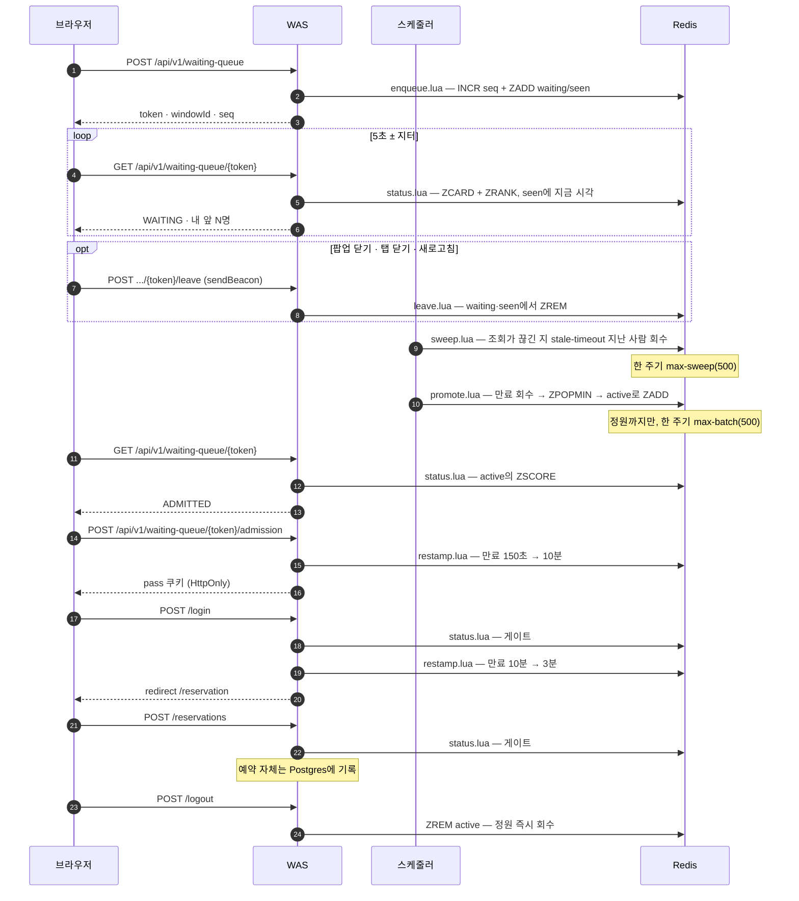
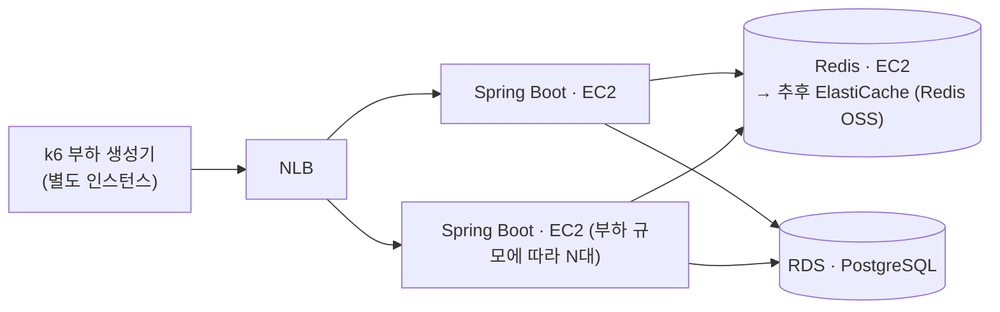

# 명절 승차권 예매

> 명절 예매급 순간 트래픽을 대기열 기반 입장 제어로 감당하는 대규모 시스템 — 병목을 직접 측정하며 설계.
> Spring Boot 4 · Java 21 · Redis 8 · PostgreSQL 18 · k6

## 프로젝트 배경 및 목적

명절 승차권 예매 환경을 가정한 대규모 예약 시스템입니다.

동시 접속자가 급증하는 상황에서 대기열, 예약 처리, 데이터베이스, 캐시 구조가 시스템 성능에 어떤 영향을 주는지 확인하기 위해서 개발을 했습니다.

단순 기능 구현보다 병목 구간을 찾고, 아키텍처 변경 전후의 처리량(TPS), 응답 시간, 자원 사용량을 측정하고 비교하는 것을 목표로 합니다.

## 문제 정의
명절 승차권 예매 서비스는 특정 시각에 대규모 사용자가 동시에 접속하는 특성을 가진 서비스입니다.

평일 승차권 예매 시스템과 달리 사용자가 좌석을 선택하거나 결제를 진행하지 않고 열차 단위로 예약을 수행합니다. 이는 제한된 시간 내에 최대한 많은 예약 요청을 처리해야 하는 명절 예매의 특성상 좌석 선택 및 결제 과정에서 발생하는 추가적인 동시성 문제와 처리 지연을 최소화하기 위한 설계라고 판단했습니다.

그럼에도 불구하고 수많은 사용자가 동시에 예약을 시도하기 때문에 다음과 같은 문제가 발생합니다.

- 순간적인 트래픽 증가로 인한 서버 및 DB 과부하
- 동일 열차에 대한 예약 요청 처리
- 잔여 좌석 수량 관리 및 데이터 정합성 보장
- 장애 발생 시 예약 데이터의 일관성 유지

실제 명절 승차권 예매 환경을 기반으로 이러한 문제를 재현하고 대기열, 캐시, 동시성 제어 전략이 시스템 성능과 안정성에 미치는 영향을 검증하는 것을 목표로 합니다.

## 설계

### 1. 대기열은 왜 Redis인가 (vs Kafka)
대기열은 단순히 요청을 순서대로 처리하는게 아니라 다음 기능을 제공해야 합니다.

- 빠른 대기열 진입
- 전체 대기 순번 조회
- 특정 사용자의 순번 조회
- 실시간 입장 처리

Kafka는 대규모 이벤트 처리에는 적합하지만 사용자의 현재 대기 순번을 실시간으로 조회하는 기능은 제공하지 않습니다. 
반면 Redis의 Sorted Set은 순번 조회, 대기열 크기 조회를 모두 O(logn) 수준으로 처리할 수 있습니다.

대기열은 단순히 조회만 수행하는 것이 아니라 정원확인 → 승격 → 만료시간 설정을 원자적 작업으로 처리를 해야합니다.
중간에 다른 요청이 끼어들면 정원 수가 어긋날 수 있기 때문입니다.
Redis는 단일 스레드와 Lua Script를 통해 이러한 작업을 원자적으로 처리할 수 있습니다.

### 2. 대기열 상태 조회 폴링에 지터를 적용
대기 순번은 클라이언트가 주기적으로 폴링하여 조회하도록 구현을 했습니다.

WebSocket, SSE는 사용자마다 연결을 유지해야 하므로, 대기 인원이 많아질수록 서버의 메모리와 소켓 자원을 지속적으로 점유합니다. 
반면에 폴링은 요청이 끝나면 연결도 종료되어 서버가 연결을 유지할 필요가 없으며, 조회도 Redis 읽기 한번으로 처리되어 부담이 크지 않습니다.

또한 모든 클라이언트가 동일한 주기로 요청하면 특정 시점에 트래픽이 집중될 수 있어, 조회 주기에 작은 랜덤 지연(Jitter)을 추가해 요청을 분산했습니다.
대기 순번은 실시간성이 크게 중요하지 않아 수 초 이내의 조회 지연을 허용할 수 있으므로, 서버 자원 효율과 안정성을 우선해 폴링 방식을 선택했습니다.

→ [설계 상세](docs/design.md#구현하면서-정한-것)

### 3. 입장은 속도가 아니라 정원으로 제어합니다
"초당 N명씩 방출"하는 방식도 가능했습니다. 하지만 그건 유입 속도만 늦출 뿐, 뒷단에 쌓이는 활성 인원은 계속 늘어납니다.
정원을 기준으로 하면 로그인·예약·DB가 동시에 상대할 인원에 상한선이 그어집니다.
대신 나간 사람과 만료된 사람을 추적해야 하는 일이 새로 생깁니다.

그래서 활성 사용자를 ZSet에 담고 만료시각을 score에 넣었습니다.
`active:holiday:{uuid}`처럼 키를 사용자마다 하나씩 두고 Redis TTL에 맡기면 만료는 공짜지만, 인원을 세려면 `SCAN`이 필요합니다.
정원 유지는 매 주기 인원을 세는 일이라 그 비용을 낼 수 없습니다.
만료시각을 score에 넣으면 정리는 `ZREMRANGEBYSCORE` 한 번, 인원은 `ZCARD`로 정확히 나옵니다.

→ [설계 상세](docs/design.md#구현하면서-정한-것)

### 4. 승격은 스케줄러가 하고, 조회 경로에는 최소한만 얹습니다
조회 요청이 스스로 "내 앞에 자리가 있나"를 판정해 입장하게 만들 수도 있었습니다.
그러면 스케줄러가 필요 없습니다. 그런데 만 명이 5초마다 폴링하면 약 2,000 rps인데,
그 경로에 정원 계산·`ZPOPMIN`·배치 상한을 전부 끌어들이는 대가가 큽니다.
승격을 초당 한 번 한 곳으로 모으면 조회는 읽기 두 번으로 남습니다.

**다만 조회가 완전히 읽기 전용으로 남지는 못했습니다.** 대기열에서 이탈한 사람을 회수하려면
"이 사람이 아직 살아 있는가"를 알아야 하는데, 폴링 말고는 그 신호가 없습니다.
그래서 `status.lua`에 `ZADD` 한 줄이 붙어 있습니다([10번](#10-떠난-사람을-알아내는-신호는-폴링밖에-없습니다)).
승격을 통째로 옮기는 것과 명령 하나를 얹는 것은 크기가 다르고, 그 하나의 비용은 잴 수 있습니다.

이 스케줄러를 다중 WAS에서 단일화해야 하는 이유는 아래 [인프라 아키텍처](#인프라-아키텍처)에 있습니다.

### 5. 단일 스레드는 원자성의 근거이면서 지연의 원인입니다
정원 확인 → 승격 → 만료 설정을 원자적으로 묶을 수 있는 건 Redis가 단일 스레드라
스크립트가 도는 동안 아무도 끼어들 수 없기 때문입니다.
그런데 같은 이유로 스크립트가 도는 동안 다른 모든 요청도 멈춰 있습니다.
원자성이 공짜인 이유와 배치가 지연 스파이크가 되는 이유는 하나입니다.

그래서 한 주기에 올리는 인원에 `max-batch`(500)로 상한을 뒀습니다.
정원이 통째로 비는 순간 만 명을 한 번에 올리면 그 시간이 그대로 다른 요청의 대기 시간이 됩니다.
상한이 실제로 걸리는 것은 관측됐습니다 — 첫 1,000명의 입장권이 한꺼번에 만료된 순간
대기 인원이 `10,000 → 9,500 → 9,000`으로 **두 주기에 나뉘어** 줄었습니다.

`promote.lua`가 `ZADD`를 한 번에 몰지 않고 루프로 도는 것도 같은 방향입니다.
Lua `unpack`에는 스택 한계(약 8,000)가 있어서, 한 방에 넘기려 들면 배치가 커질 때
스크립트가 아예 깨집니다.

다만 500이 맞는 값인지는 아직 모릅니다 — 현재 관측 해상도(1초)로는
배치 실행 시간과 요청 지연을 같은 축에 놓고 분리할 수 없습니다.

→ [입장 제어 검증](docs/measurement.md#입장-제어-검증)

### 6. 입장권 만료는 값 하나를 다시 찍어 표현합니다
승격 150초 → 입장 확정 10분 → 로그인 3분 → 로그아웃 즉시 삭제.
단계마다 시간이 바뀌지만 값은 `active` ZSet의 score 하나뿐이고, 그게 곧 "이 사람이 자원을 쥐고 있는 시간"입니다.

승격 직후를 짧게 준 건 유령을 걸러내기 위해서입니다.
폴링하지 않는 사용자는 입장 확정까지 오지 못해 150초 뒤 슬롯이 회수됩니다.
150초는 폴링 주기(5초)의 30배인데, 브라우저가 비활성 탭의 타이머를 강하게 늦추기 때문에
딴 탭에 가 있던 정상 사용자가 승격을 놓칠 여유를 준 값입니다.

만료 판정용 인터셉터를 따로 두지 않은 이유도 여기 있습니다.
게이트가 이미 매 요청 이 score를 보고 있어서 진실 원천이 둘로 갈라지지 않습니다.

→ [단계별 만료 표](docs/design.md#활성-슬롯-만료-라이프사이클)

### 7. 게이트는 쿠키의 존재가 아니라 Redis를 봅니다
쿠키는 클라이언트가 들고 있는 값이라 얼마든지 지어낼 수 있습니다.
매 화면 진입마다 `active` ZSet에 그 토큰이 살아 있는지 확인해야 정원과 만료가 실제로 강제됩니다.
조회에 쓰는 스크립트가 이미 `ZSCORE`로 만료까지 판정하고 있어 새 스크립트 없이 그대로 씁니다.
화면 진입당 한 번이라 폴링 경로와 달리 인원수만큼 곱해지지 않습니다.
그래서 입장권 만료가 로그인 세션을 이깁니다 — 로그인한 채로 활성 자리가 회수되면 예약 화면은 랜딩으로 돌려보냅니다.

Spring Security를 넣지 않고 `spring-security-crypto`의 BCrypt만 가져온 것,
인터셉터를 `/**`가 아니라 화이트리스트로 등록한 것도 같은 이유입니다.
이 프로젝트는 진입 처리량의 변화를 근거로 삼기 때문에 대기열 경로에 요청당 비용을 얹는 대가가 큽니다.
대가는 둘입니다. 새 화면을 만들 때 화이트리스트 등록을 빠뜨리면 그 경로는 제한 시간이 지나도 그대로 열려 있고,
CSRF 토큰이 없어 `SameSite=Lax`로 대신하고 있습니다(완전한 대체는 아닙니다).

→ [설계 상세](docs/design.md#구현하면서-정한-것) · [알려진 한계](docs/design.md#알려진-한계)

### 8. Redis가 진실 원천이면, Redis가 죽는 그림도 설계에 포함됩니다
대기열이 Redis에만 있으니 Redis가 사라지면 줄도 사라집니다.
그래서 영속성을 켜는 쪽이 먼저 떠오르는데, `appendfsync everysec`으로도 크래시 시
최대 1초분이 사라집니다 — 34k rps면 약 3만 4천 명입니다.
"아무도 자리를 잃지 않는다"는 어차피 성립하지 않고, 절반만 남은 줄은 통째로 없는 줄보다
다루기 어렵습니다.

그래서 반대로 정의했습니다. **Redis가 잃는 것은 데이터가 아니라 줄 서기 공정성입니다.**
실제 기록(예약)은 Postgres에 있고, 대기열 소실은 이미 Expired → 랜딩 리다이렉트로
처리되는 경로입니다. 영속성은 껐습니다(`save ""` · `appendonly no`).

메모리가 차는 쪽은 다르게 다룹니다. `allkeys-lru`였다면 대기 순번이 조용히 사라져
대기열 자체가 망가집니다. `noeviction`은 쓰기를 거부하는데, 그 실패는 눈에 보이므로
오히려 다뤄볼 수 있습니다. `maxmemory`(512mb)를 컨테이너 `mem_limit`(1G)보다 낮게 잡은
것도 같은 이유입니다 — Redis가 자기 한도에 먼저 걸려야 컨테이너 OOM Kill 대신
애플리케이션이 관측할 수 있는 에러로 드러납니다.

Redis를 실제로 내려 보고 확인한 것: 진입 API는 503이고, 승격 스케줄러는 죽지 않고
주기마다 경고 한 줄만 남기며 Redis가 살아나면 다음 주기에 스스로 재개합니다.
다만 타임아웃 기본값(60초)에서는 서버가 503을 주는 게 아니라 그냥 매달렸습니다.
측정용 프로파일에서 1초로 줄이고, 클라이언트에도 `AbortSignal`(진입 10초·조회 5초)을
걸어 먼저 끊게 했습니다.

→ [Redis를 휘발성으로 둡니다](docs/design.md#redis를-휘발성으로-둡니다)

### 9. 왜 PostgreSQL인가 — 근거는 다음 페이즈에 있습니다
지금 스키마(계정·열차·재고·예약)만 놓고 보면 어느 DB든 상관없습니다.
구간 열차 예매의 핵심 동시성 문제는 "같은 좌석의 겹치는 구간을 두 사람이 예약"인데,
Postgres는 이걸 애플리케이션 락 없이 배타 제약(`EXCLUDE` + GiST)으로 선언할 수 있습니다.
MySQL에는 대응물이 없어 락으로 직접 풀어야 합니다.
MVCC, `SELECT ... FOR UPDATE SKIP LOCKED`, `EXPLAIN ANALYZE`도 측정이 목적인 이 프로젝트에 맞습니다.

다만 아직 실행되지 않은 약속입니다.
현재 스키마에는 `EXCLUDE`도 GiST도 range 타입도 없고,
재고는 `(열차, 좌석 등급)` 카운터 행의 조건부 `UPDATE`로 지키고 있습니다.

→ [설계 상세](docs/design.md#왜-postgresql인가)

### 10. 떠난 사람을 알아내는 신호는 폴링밖에 없습니다
줄을 서 놓고 그냥 사라진 사람이 남으면 뒷사람의 순번이 부풀 뿐 아니라,
**그 유령도 순서가 되면 승격되어 아무도 쓰지 않는 활성 슬롯을 `admission-grace`만큼 잡습니다.**
실효 정원이 깎이므로 정원 제어 자체가 흐려집니다.

이탈 경로는 셋인데 성격이 다릅니다. 팝업을 닫는 것은 확실히 잡히고, 탭을 닫거나 새로고침하는 것은
`pagehide` + `sendBeacon`으로 대개 잡힙니다. 그런데 크래시·기기 꺼짐·네트워크 단절에는
브라우저 이벤트가 **아예 오지 않습니다.** 그래서 클라이언트 신호만으로는 유령이 남습니다.

남은 신호는 폴링뿐입니다. 이미 5초마다 오고 있으니 그걸 하트비트로 재해석하고,
마지막 조회 시각이 `stale-timeout`보다 오래된 사람을 스위퍼가 회수합니다.
별도 하트비트 엔드포인트를 두면 조회를 읽기 전용으로 지킬 수 있지만 요청 수가 두 배가 됩니다.

여기에 걸림돌이 하나 있었습니다. `active`는 score가 만료시각이라 `ZREMRANGEBYSCORE` 한 번으로
청소되는데, **`waiting`은 score가 `seq`(순번)입니다.** `ZRANK`가 순번의 근거라 score를 바꿀 수 없어서,
"값 하나가 곧 진실"([6번](#6-입장권-만료는-값-하나를-다시-찍어-표현합니다))을 여기서는 쓰지 못하고
마지막 조회 시각을 담는 `seen` ZSet을 따로 뒀습니다. 대기열 메모리가 사실상 두 배가 되는 대가입니다.

스위퍼에도 `max-batch`와 같은 이유로 `max-sweep` 상한이 있습니다 —
대량 이탈이 한 번에 몰리는 순간 상한이 없으면 그게 그대로 지연 스파이크가 됩니다.

→ [설계 상세](docs/design.md#대기열-이탈-처리)

## 동작 흐름

진입부터 로그아웃까지 한 사람이 지나가는 경로입니다.
Redis를 건드리는 모든 지점이 Lua 스크립트 하나에 대응하고, 진실 원천은 두 ZSet뿐입니다.

각 단계가 어느 스크립트를 쓰고, 왜 원자적이어야 하는지입니다.

| 단계 | 스크립트 · 명령 | 원자성이 필요한 이유 |
|---|---|---|
| 진입 | `enqueue.lua` | 순번 발급과 등록이 갈라지면 순번이 유실되거나 겹친다 |
| 순번 조회 | `status.lua` | `ZCARD`·`ZRANK`가 다른 순간의 값이면 앞뒤 합이 어긋난다 ([5번](#5-단일-스레드는-원자성의-근거이면서-지연의-원인입니다)) |
| 이탈 | `leave.lua` | `waiting`에서만 빠지고 `seen`에 남으면 스위퍼가 매 주기 헛돈다 ([10번](#10-떠난-사람을-알아내는-신호는-폴링밖에-없습니다)) |
| 이탈 회수 | `sweep.lua` | 찾는 것과 지우는 것이 갈라지면 그 사이에 승격된 사람을 지운다 |
| 승격 | `promote.lua` | 세는 것과 꺼내는 것이 갈라지면 정원을 넘긴다 ([3번](#3-입장은-속도가-아니라-정원으로-제어합니다)) |
| 입장 확정 | `restamp.lua` | 만료된 슬롯을 되살리지 않으려면 검사와 갱신이 한 연산이어야 한다 |
| 로그인 | `restamp.lua` | 같은 스크립트, `ttl`만 다르다 ([6번](#6-입장권-만료는-값-하나를-다시-찍어-표현합니다)) |
| 화면 진입 게이트 | `status.lua` 재사용 | 쿠키의 존재가 아니라 `active`의 score를 본다 ([7번](#7-게이트는-쿠키의-존재가-아니라-redis를-봅니다)) |
| 로그아웃 | `ZREM` 단일 명령 | 원자성이 필요 없다 — 묶을 것이 없다 |

게이트(`AdmissionGuard`·`LoginGuard`)는 `/**`가 아니라 `/login` · `/reservation` ·
`/reservations` · `/reservations/*/cancel` 네 경로만 탑니다.
`/logout`은 일부러 빼 뒀습니다 — 입장권이 만료된 사람도 세션은 정리할 수 있어야 하고,
자격이 없다고 돌려보내면 세션만 남습니다.

## 인프라 아키텍처

측정이 목적인 시스템이라, 컴포넌트를 분리해 병목을 각각 따로 관찰할 수 있게 배치합니다.

- **Spring Boot(WAS)는 EC2에서 실행하고, 부하 규모에 따라 여러 대로 늘려 앞단에 NLB를 둡니다.**
  대기열 진입·조회 경로가 사실상 얇은 Redis 프록시라 요청당 지연에 민감한데, L4인 NLB는 HTTP
  파싱 없이 통과시켜 측정에 얹는 변수가 가장 적습니다. 명절 rush 같은 순간 급증도 사전 워밍업 없이
  받아냅니다. 경로 라우팅·WAF 같은 L7 기능이 필요해지면 그때 ALB를 재검토합니다.
- **부하 생성기(k6)는 WAS와 분리합니다.** 같은 머신에서 CPU를 나눠 쓰면 측정 대상이 아니라
  생성기를 측정하게 됩니다.
- **DB는 RDS의 PostgreSQL을 사용합니다.** 계정·예약 테이블뿐이라 진입 hot path엔 걸리지 않아
  관리형으로 운영 부담을 덜되, 다음 좌석 페이즈의 배타 제약(EXCLUDE + GiST)·MVCC를 위해 엔진은
  PostgreSQL을 유지합니다.
- **Redis는 EC2에서 실행합니다.** 대기열의 진실 원천이라 CPU·메모리·버전을 직접 통제해 재현성을
  지킵니다. 추후 **ElastiCache(Redis OSS)**로 옮겨 관리형과 자체 호스팅의 처리량·지연을 비교할 수
  있습니다.

다중 WAS로 확장할 때는 두 가지가 선행되어야 합니다. 톰캣 인메모리 세션을 Redis로 외부화하고
(`spring-session-data-redis`), 승격 스케줄러를 단일화합니다 — 인스턴스마다 돌면 승격 배치가
N배가 되기 때문입니다. 근거는 [설계 상세](docs/design.md)에 있습니다.

### Redis는 이 워크로드에서 옆으로 늘어나지 않습니다

WAS는 NLB 뒤로 N대까지 늘리면 되지만, Redis는 같은 방식으로 늘어나지 않습니다.
세 갈래를 다 따져 보면 결론이 같습니다.

- **Cluster로 가려면 키를 먼저 묶어야 합니다.** `waiting:` / `active:` 접두사가 달라 두 키가
  다른 슬롯에 떨어지고, 둘을 함께 넘기는 `status`·`promote`가 CROSSSLOT으로 깨집니다.
  해시 태그로 묶는 것이 선행 조건입니다.
- **묶어도 샤딩 이득이 없습니다.** 묶는다는 건 한 이벤트의 키를 같은 슬롯(=같은 노드)에
  모으는 것이라, 그 이벤트의 트래픽은 전부 한 노드로 갑니다. 대기열은 본질적으로 단일 핫 키
  워크로드이고, 실질적인 분할 축은 이벤트(날짜·열차) 단위뿐입니다.
  다만 이건 아직 측정하지 않은 판단입니다.
- **조회를 리플리카로 보내는 길은 이제 닫혀 있습니다.** 조회 경로가 하트비트로 `seen`에
  `ZADD`를 하기 때문에([10번](#10-떠난-사람을-알아내는-신호는-폴링밖에-없습니다)) 애초에 읽기 전용이
  아니고, 리플리카는 쓰기를 받지 않습니다.

마지막 갈래가 이 시스템의 진짜 트레이드오프입니다. **유령을 회수하는 값과 읽기를 흩는 값 중
하나를 골라야 했고, 회수를 골랐습니다.** 유령은 순번을 부풀릴 뿐 아니라 실효 정원을 깎지만,
읽기 확장은 아직 필요해진 적이 없습니다 — 병목이 Redis가 아니라는 것이 [측정](#측정-결과)으로 나왔습니다.

되돌린다면 순서는 이렇습니다. `seen` 갱신을 조회에서 떼어내 별도 하트비트로 옮기면
(요청 수는 두 배가 됩니다) 조회가 다시 읽기 전용이 되지만, 그래도 한 관문이 더 남습니다 —
`status.lua`라서 `EVALSHA`는 읽기 전용으로 선언되지 않아 리플리카로 라우팅되지 않습니다
(Redis 7이 `EVAL_RO`를 추가한 이유가 이것입니다). 그런데 spring-data-redis 4.1.0의
`RedisScriptingCommands`에는 `eval`·`evalSha`만 있고 RO 변종이 없어,
`DefaultScriptExecutor`는 항상 `EVALSHA`를 부릅니다. Lua를 벗고 개별 명령으로 돌아가면
`status.lua`가 보장하던 **한 스냅샷**을 잃습니다 — 복제 지연만큼 순번이 과거값이 되는 것은
이미 허용한 대가([2번](#2-대기열-상태-조회-폴링에-지터를-적용))지만,
`앞 + 뒤 + 1 = 전체`가 어긋나는 건 다른 종류의 대가입니다.

## 측정 결과

### Redis는 병목이 아니었습니다 — 그렇게 추론했다가 실험으로 뒤집었습니다

`redis-benchmark`로 구간을 끊어 재고 앱과 나란히 놓았을 때, 세 수치는 이렇게 보였습니다.

| 측정 대상 | 처리량 |
|---|---|
| Redis 자체 (컨테이너 안) | 107,009 rps |
| 호스트 → Docker → Redis (앱과 같은 경로) | 37,908 rps |
| Spring Boot 앱 전체 | 34,129 rps |

앱의 34k가 경로 한계 38k에 거의 붙어 있으니 **병목은 Docker 네트워킹**이라고 판단했습니다.
그런데 이건 상관이지 인과가 아닙니다. 그래서 Redis를 Docker 밖(호스트 네이티브)으로 빼
경로 천장을 **2.9배**(36,576 → 105,764 rps) 열고 같은 시나리오를 그대로 돌렸습니다.

| | 평균 rps | 앱 평균 지연 |
|---|---|---|
| A · Docker Redis | 27,071 | 35.82ms |
| B · 네이티브 Redis | **28,802** | 33.89ms |

**+6.4%만 올랐습니다.** 천장을 3배 열었는데 앱은 그대로였다는 뜻입니다.
수치도 맞물립니다 — `redis-benchmark` p50 차가 요청당 1.83ms이고 앱은 요청당 Redis 호출이
1회인데, 실제 관측된 지연 감소가 1.92ms로 거의 같습니다. 35ms 요청에서 1.9ms면 5%입니다.

즉 **Redis 경로는 앱 지연의 5% 남짓**이고, Redis가 실제로 일하는 시간은 **8.37μs**입니다.
나머지 90% 이상은 Tomcat·가상 스레드·루프백 TCP, 그리고 같은 Mac에서 도는 k6와의 CPU 경합에
있습니다. knee(처리량이 꺾이는 지점)도 천장을 열기 전과 후 모두 VUS 1,000 근처로 움직이지
않았습니다.

교란 변수는 통제하지 못한 것들이 있습니다 — Redis 버전(호스트 8.6.2 vs 컨테이너 8.8.0),
CPU 상한이 컨테이너에만 걸려 있는 점, `kern.ipc.somaxconn`이 128인 점.
그리고 **절대 수치는 같은 머신·같은 세션 안에서만 비교 유효**합니다.

→ [측정 상세 · 조건 · 전체 표](docs/measurement.md)

## 더 읽기
